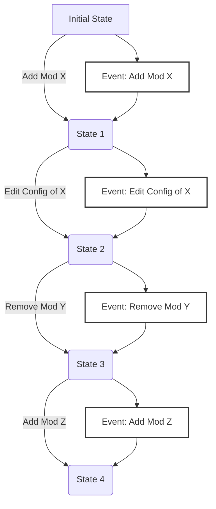

# Arbitrary Blob Storage for Modding Tools

- **Status:** Unknown/Shortlisted

!!! info "Enabling modding tools to store small amounts of user-specific data tied to their accounts"

To enable a smooth, seamless user experience, modding tools need the ability to store small amounts
of user-specific data that can persist across devices and be backed up automatically.

## The Problem

!!! warning "Currently, modding tools lose all data when users switch devices or reinstall"

    This creates a suboptimal user experience, especially for people who spend hundreds of hours
    curating their perfect mod setups.

Today's modding ecosystem suffers from several critical issues:

- **Device Changes**: When users get a new computer or reinstall their OS, they lose everything
- **Backup Complexity**: Advanced users must manually backup dozens of different configuration files across different modding tools
- **No Cross-Device Sync**: Cannot painlessly (automatically) move a carefully crafted loadout between desktop and Steam Deck
- **Lost Investments**: Hours of mod configuration work vanishes with hardware failures

!!! note 

    While [Collections](https://www.nexusmods.com/collections) partially address this, they still
    require manual work in the form of *manually* uploading and downloading new revisions as you switch
    devices. ***They also only sync mods.***
    
    All other configurations, such as mod manager preferences cannot be saved.

### A Real-World Example: Reloaded3

!!! example "I will use my [Reloaded3 Modding Framework Specification](https://reloaded-project.github.io/Reloaded-III/) as an example."

    This is what I've been building towards, every hour of every weekend for the past 2 years.<br/>
    I still have 3-4 years of work ahead of me 😅

As a modding framework author, I've witnessed these pain points firsthand.

In my specific case, here's what would need to be synced.

#### Mod Manager/Loader Settings

!!! tip "Global preferences that apply across the whole ecosystem"

These include framework-wide settings that users expect to persist:

- **UI Preferences**: Theme selection, layout arrangements, language, window positions
- **Default Behaviors**: Auto-update settings, notification preferences
- **Authentication Data**: Usernames (not passwords) for accounts (Nexus, Steam, GOG etc.)
- **Global Mod Paths**: Default installation directories, cache locations
- **Per-Game Settings**: e.g. Game Icon, Name, Launch Options, How to Inject Loader, Machine Specific Settings.

[Related (partially complete) docs here.](https://reloaded-project.github.io/Reloaded-III/Server/Storage/Locations.html#items-to-store)

**Size Estimate**: 
```
UI layout data: ~200 bytes
Game specific: ~1.5KB per game
General manager settings: ~1KB
```

##### Custom Loadout Icons (Optional)

!!! info "Some users may choose to apply custom icons to their loadouts"

    By default, icons are sourced from `SteamGridDB` so use no space in blob storage
    (user will fetch icons themselves). However, in some cases users may choose their own,
    which would need backup.

**Icon Type Specifications**:

| Type              | Ratio | Resolution | File Type      | Expected Size |
| ----------------- | ----- | ---------- | -------------- | ------------- |
| Icon              | 1:1   | 256×256    | JPEG XL (.jxl) | ~60 KiB       |
| Banner Square     | 1:1   | 512×512    | JPEG XL (.jxl) | ~120 KiB      |
| Banner Vertical   | 2:3   | 600×900    | JPEG XL (.jxl) | ~210 KiB      |
| Banner Horizontal | 92:43 | 920×430    | JPEG XL (.jxl) | ~180 KiB      |

[Relevant Wiki Page](https://reloaded-project.github.io/Reloaded-III/Services/Community-Repository.html#icons-and-banners-steamgriddb)
  
#### Loadouts (Including Mod Configurations)

!!! info "A complete mod setup for a specific game"

    A profile that's attached to a specific game, containing all mods and their configurations.<br/>
    Same as on the left hand spine on the Nexus Mods App.

These use the 'Event Sourcing' model, where the contents of a loadout are represented as a sequence 
of events that describe changes made to the loadout over time.

This allows for rolling back to any previous state by replaying the events in order.



Exact details of loadouts is described [here](https://reloaded-project.github.io/Reloaded-III/Server/Storage/Loadouts/About.html).

These are [event driven](https://reloaded-project.github.io/Reloaded-III/Server/Storage/Loadouts/File-Format/Events.html)
containing information such as:

- **Package List**: Historical (minimal) metadata of packages used in the Loadout
- **Package Configurations**: History of configuration settings for each mod
- **Load Order**: Arrangement of mods and their loading priority
- **Event History**: Every other change tracked as compressed events . e.g. 'Game Launched'

Events are currently estimated to be around 8 bytes on average after compression, once we factor
in mod configurations and [strings required to reconstruct the commit messages](https://reloaded-project.github.io/Reloaded-III/Server/Storage/Loadouts/File-Format/Commit-Messages.html).

A typical large loadout with 2000 mods and 20 events per mod install would look like this:

```
2000 mods × 20 events × 8 bytes = 320 KB per complete loadout history
```

#### Total Storage Requirements

!!! info "After compression, as stored on servers"

```
Mod Framework Configs: 3 KB
Large Loadout (2000 mods): ~320 KB
```

***A typical user*** would be expected to use `~200KB` of storage total.  
***A power user*** might use `~1.5-2.0MB` total.

(In my opinion, based on limited numbers from asking random users using `Reloaded-II`, the predecessor.)

!!! note "Space requirements for functionality of this kind differ between projects and modding frameworks."

    My spec is very optimized for size because I'm both a performance freak and have been accounting
    for the worst case scenario of hosting everything myself 100k+ users.

    Different projects may have different requirements however. For instance, a similar 
    system for the Nexus Mods App might use 5MB, instead of 320KB, as it stores much more granular
    info, such as file path mappings telling us where each file from each mod should go to and
    archive analysis results.(1)
    { .annotate }

    1. The App's database grows to 8MB (after compression) if you manage Stardew Valley and install a
    collection of 100 mods from a clean state. So if it were a raw database backup, it could be
    something like 20-50MB for a 2000 mod setup. That said, I believe with a custom export format/syncing
    method, it could be reduced to around 5MB at the very least.

## Technical Implementation

### Minimal Required API

!!! info "This is the minimal API that would be required to implement this"

    'Minimum Viable Product', so to call it.

```rust
pub trait BlobStorage {
    /// Get remaining free space and quota information
    async fn get_quota_info(&self) -> Result<QuotaInfo, BlobStorageError>;
    
    /// Upload/save a file with optional overwrite capability
    async fn upload_file(
        &self,
        name: &str,
        data: &[u8],
        overwrite: bool
    ) -> Result<(), BlobStorageError>;
    
    /// Download/load a file by name
    async fn download_file(&self, name: &str) -> Result<Vec<u8>, BlobStorageError>;
    
    /// Delete a file by name
    async fn delete_file(&self, name: &str) -> Result<(), BlobStorageError>;
    
    /// List all files with their metadata
    async fn list_files(&self) -> Result<Vec<FileInfo>, BlobStorageError>;
    
    /// Check if a file exists
    async fn file_exists(&self, name: &str) -> Result<bool, BlobStorageError>;
}

/// Storage quota information
#[derive(Debug)]
pub struct QuotaInfo {
    pub used_bytes: u64,
    pub available_bytes: u64,
    pub file_count: u32,
    pub max_file_count: u32,
}

/// Server-side error types for blob storage operations
#[derive(Debug)]
pub enum BlobStorageError {
    // Authentication and authorization errors
    Unauthenticated,        // User not logged in or invalid session
    Unauthorized,           // User lacks permission for this operation
    TokenExpired,           // Authentication token has expired
    
    // Storage quota and space errors
    QuotaExceeded,          // User has exceeded their storage limit
    FileTooLarge,           // File exceeds maximum allowed size
    TooManyFiles,           // User has reached maximum file count limit
    
    // File operation errors
    FileNotFound,           // Requested file does not exist
    FileAlreadyExists,      // File exists and overwrite was disabled
    InvalidFileName,        // Filename contains invalid characters or format
    
    // Server and internal errors
    InternalError(String),  // Generic server-side error with details
}

/// File metadata information
#[derive(Debug)]
pub struct FileInfo {
    pub name: String,
    pub size: u64,
    pub modified_at: SystemTime,
}
```

### Security Considerations

!!! warning "Privacy and security are paramount for user adoption"

Call some of these 'stretch goals' if you will, but they are essential in the long run.

#### Program Isolation and Identity Verification

!!! info "Ideally each modding tool should have its own isolated storage space"

These should have separate quotas to prevent interference between applications. 
If one program is putting files, you obviously don't want another program to delete them; the user
could lose important stuff!

However, this creates challenges:

- **Identity Spoofing Risk**: Malicious programs could potentially impersonate other modding tools
- **Authentication Complexity**: Robust identification requires code signing, certificates etc. too painful for everyone.
- **Practical Compromise**: A middle-ground approach could use application-declared namespaces with user confirmation for first-time access

**Example Isolation Strategy**:

```rust
// (Simplified example, pseudocode.)
// Application requests blob storage access with OAuth token and declared namespace
async fn get_blob_storage_api(
    oauth_token: &str,
    namespace: &str
) -> Result<Box<dyn BlobStorage>, BlobStorageError> {
    let client = BlobStorageClient::new(oauth_token);
    
    // Check if this OAuth token has accessed this namespace before
    // OAuth token, as in the token used during login
    match client.request_namespace_access(namespace).await? {
        NamespaceAccessResult::Granted(storage) => {
            // Previously authorized, return storage API immediately
            Ok(storage)
        }
        NamespaceAccessResult::RequiresConfirmation => {
            // First-time access - user confirmation needed
            let confirmation_url = client.get_confirmation_url(namespace).await?;
            
            // Show user a confirmation dialog/browser popup
            println!("Application '{}' is requesting access to namespace '{}'", get_app_name(), namespace);
            println!("Please visit: {}", confirmation_url);
            
            // Wait for user confirmation
            client.wait_for_confirmation().await?;
            
            // Return authorized storage API
            Ok(client.get_storage_api(namespace).await?)
        }
    }
}

// Usage example
async fn example_usage() -> Result<(), BlobStorageError> {
    // Reloaded3 requests access to its own namespace
    let storage = get_blob_storage_api(
        &nexus_oauth_token,
        "reloaded3"  // Application-declared namespace
    ).await?;
    
    // Now can safely use the storage API
    storage.upload_file("loadouts/loadout_flatoutuc_1.nx", &loadout_data, true).await?;
    
    Ok(())
}

enum NamespaceAccessResult {
    Granted(Box<dyn BlobStorage>),
    RequiresConfirmation,
}
```

An alternative approach is just have the user login again.
That would prevent the potential attack vector of a malicious program stealing the OAuth token
from another program.

#### Data Retention

!!! info "Protecting users from accidental and malicious data loss"

As a last resort defense against malicious programs or user errors, we could offer automatic backup protection.

**48-Hour Recovery Service**: 

- **Automatic Snapshotting**: Make 'snapshots' of user data every 2 days.
- **Snapshot Retention**: Snapshots are kept for 8 days, to account for weekends and delays.
- **Rewind**: Users can request a rewind to a specific snapshot.
- **Automatic Cleanup**: Every snapshot, delete files from snapshots older than 8 days.

The snapshots internally could be represented as a list of files and their corresponding hashes;
think 'object storage' style deduplication. Taking a snapshot does not mean making a copy of all files;
rather, snapshots just extend the lifetimes of files (like a recycle bin), until files older than 8 days
are automatically deleted. Impact on storage used is minimal.

**Use Cases for Recovery Service**:

- **Malicious Software**: If a rogue program deletes all user loadouts, they can be recovered
- **User Mistakes**: Accidental deletion of important configurations can be undone
- **App Bugs**: Software errors that cause data loss can be mitigated
- **Device Issues**: Corrupted local storage leading to re-sync from "empty" state

**Restoration Process**: Initially, we could manually process recovery requests as needed, since this service would not be used often. Users would contact support to restore their storage state to a specific point. Eventually, if this was commonly requested, a web dashboard with a timeline slider-like interface could be added where users can "rewind" their entire configuration with one click, similar to a "time machine" backup.

## Miscellaneous

I'd also love to sync my preferences for standalone modding tools, by for example; shipping them
from a mod manager and saving their settings to blob storage. e.g. Hotkeys, UI preferences, etc.

## Competitive Advantage

!!! success "This would be a differentiator for any modding platform"

### Addressing User Sign-Up Resistance

!!! info "A common piece of feedback from users is questioning *why* they need to sign up to download mods."

    We can flip the script here.<br/>
    Instead of having users why they should sign up, why not make users ask why they *shouldn't* sign up?

    Make the user experience so compelling that users *want* to create accounts.

    Think *'why do people buy on Steam and not Epic Games Store?'*

Blob storage creates a powerful incentive for account creation:

- **Essential Features Require Sign-In**: Synchronization, cloud backup, and cross-device access become impossible without an account
- **Immediate Value**: Users see tangible benefits from day one - their configurations are automatically backed up
- **Progressive Enhancement**: Free tier provides sync, premium could unlock extra features like extended history (6 months) and higher quotas.

### Strategic Platform Benefits

!!! info "Rather than making silly bullet points, I will say it as straight as I can."

From the perspective of a ***Modding Framework Author***, creating many tools that are used by users
on Nexus Mods and outside; which are crucial to modding games; blob storage would be a game changer.

Having a feature like this from a developer's perspective is *extremely convenient*, if the
feature was available, I would have *zero reasons* to look for any alternatives; including self-hosting.
Authentication, maintenance, and storage management would all be handled for me.

That, therefore means, that signing in with a Nexus Mods account would practically become *a requirement*
for getting the best experience with my tools.
