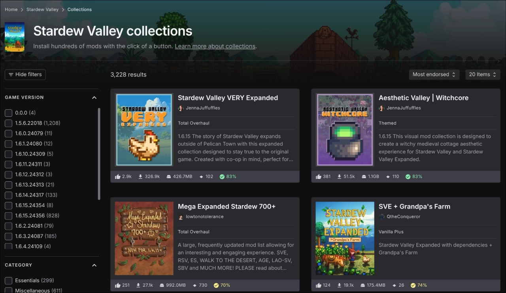
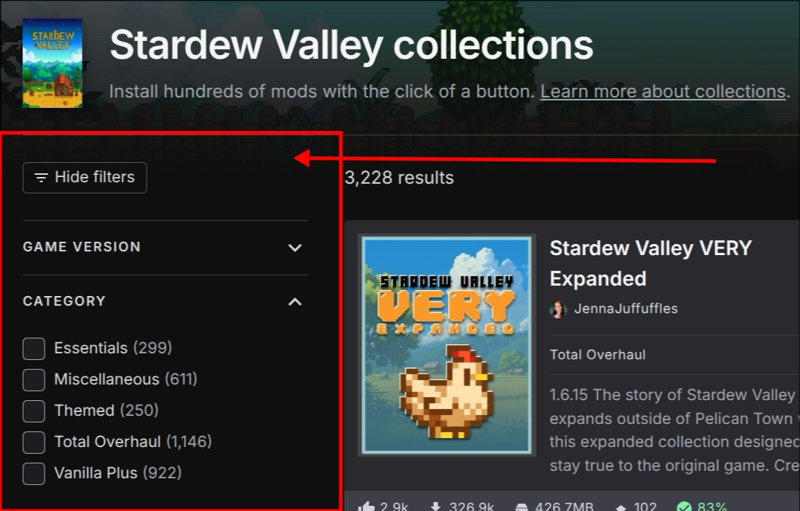

# Collections Support for External Software

- **Status:** Unknown

!!! info "Enabling Modding Tools other than Vortex to create and share collections."

<figure markdown="span" class="annotate">
  
  <figcaption>Collections are used to share mod setups<br/>with friends and the community</figcaption>
</figure>

This would allow any modding tool to leverage the collections system, making mod setups shareable
across different software ecosystems while maintaining compatibility and custom metadata.

As a ***Modding Framework*** author, I want to be able to tap into the collections system to allow
users to share their mod setups.

## The Problem

!!! warning "Collections are currently locked to Vortex"

    The current collections system assumes ***every collection must be installable by Vortex***, which
    prevents other modding tools from participating in the ecosystem.

This is problematic, as it limits the usability of collections:

- Popular tools on Nexus like `Mod Organizer 2` cannot utilize collections
    - And that discourages users from using collections at all
- Our own `Nexus Mods App` *would only be allowed* to create collections for games supported by Vortex

Collections use V2 APIs that were historically discouraged for external use.  
In fact, we historically were not allowed to talk about the V2 API publicly at all.

## Proposed Solution

!!! tip "Multi-software collections with custom metadata support"

### Software Compatibility Field

!!! info "Add a field to collections that indicates which software can install/use them."

Currently, the collection header contains basic metadata like this:

```json
{
  "info": {
    "author": "llamas6969",
    "authorUrl": "",
    "name": "Honour Mode",
    "description": "",
    "installInstructions": "",
    "domainName": "baldursgate3",
    "gameVersions": [
      "4.68.5.605"
    ]
  }
}
```

We need to extend this with software compatibility information:

```json
{
  "info": {
    // ...existing fields...
    "supported_software": [
      {
        "name": "vortex",
        "version_min": "1.6.0",
        "version_max": null
      },
      {
        "name": "nexus_mods_app",
        "version_min": "0.11.2",
        "version_max": null
      }
    ]
  }
}
```

For all existing collections, we can attach the `vortex` moniker by default.  
For `nexus_mods_app`, we can attach it to games that are supported by the app as these become available.  

For other software, we can allow authors to specify their own compatibility.

### Custom Metadata Storage

!!! info "Allow attaching binary blobs or structured data for each supported software"

    For software that does not use conventional metadata in the same style as Vortex.

```json
{
  "custom_metadata": {
    "reloaded3": {
      "blob_id": "reloaded3_loadout.bin"
    }
  }
}
```

!!! info "To best of my awareness, this is already possible with 'hacks'"

    It's more about having an explicit, supported way to do this.

Things we can now do:

- Distinguish which mod managers support which collections
- Filter collections by supported Mod Manager  
- Support extra metadata for each Mod Manager
- Compatibility Warnings: Show warnings before installation attempts
- Provide software-specific installation guidance

### Filtering by Mod Manager

<figure markdown="span" class="annotate">
  
  <figcaption>A filter option to be added right here.</figcaption>
</figure>

This leverages the new `supported_software` field to allow users to filter collections
by support of their preferred mod manager.

## Benefits

!!! success "Why this would be valuable"

**For Users**: 

- Users would no longer hesitate to create collections because of software lock-in.
- More community software that integrates with Nexus Mods to specifically utilize collections.
- Can use collections with your preferred software, not just Vortex.

**For Nexus Mods**: 

- Keeps users engaged on the Nexus Mods service across different software.
    - Rather than using other platforms.
- Becomes the central hub for all mod collections.