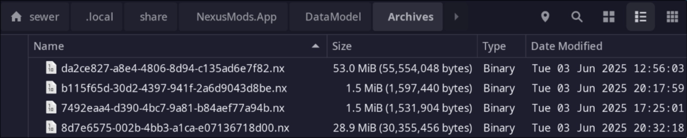
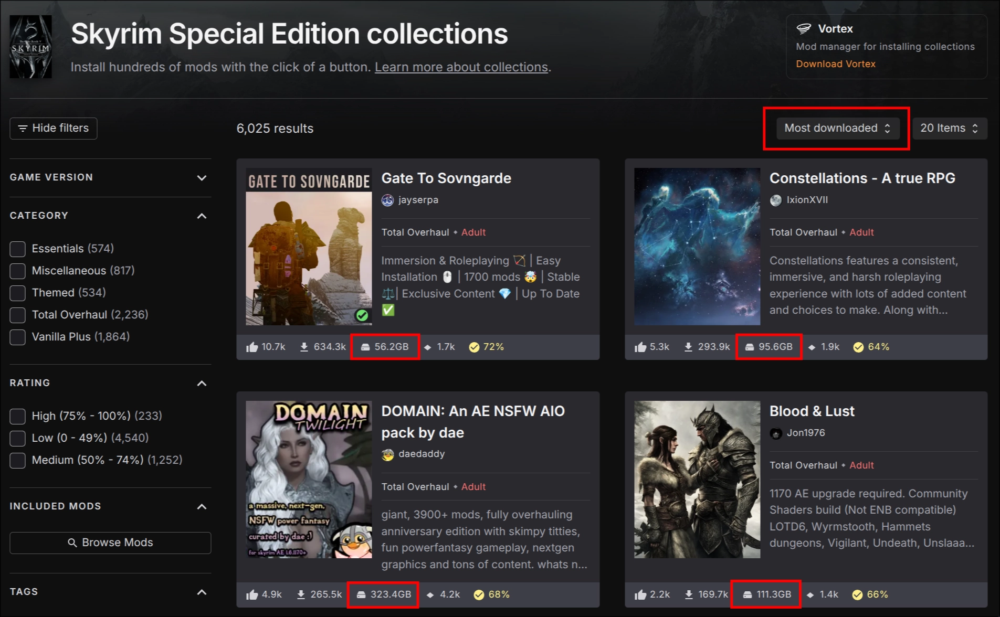

# Lossless Texture Transform Library

- **Status:** In Progress (Own Project)

!!! info "A high-performance library for losslessly improving the compression ratio of DXT compressed textures"

    [GitHub Repository](https://github.com/Sewer56/dxt-lossless-transform) | Working on this every hour of every weekend

This is a specialized library that transforms how the data of `.DDS` textures is stored in a reversible way.  
We modify how the data is stored to achieve better compression ratios when storing texture assets.

## The Problem

!!! warning "Textures form around 80-90% of total disk space used in modern games"

    And equally as much, if not more in mods; as visual overhauls are *very, very popular*.

I'm building ***bleeding edge*** technology to slash the amount of space used by textures in a lossless
matter(1).
{ .annotate }

1. Literally lossless, every pixel is 1:1 with original image. Transform is reversible to restore original file.

!!! tip "[You can learn more on a blog series I started this year.](https://sewer56.dev/blog/category/texture-compression-in-nx20.html)"

## A Demonstration

!!! note "To demonstrate I'll use the most downloaded mod for the most popular game on [nexusmods.com](https://nexusmods.com)"

    This is [Skyrim 202X by Pfuscher](https://www.nexusmods.com/skyrimspecialedition/mods/2347?tab=files) for Skyrim Special Edition.

I will test on a dataset containing every single texture encoded with the BC1 format from from the mod's main downloads(1):
{ .annotate }

1. The transforms for BC2, BC3, and BC7 are not yet ready for prime time. So I'm testing the completed one here!

- [-Skyrim 202X 10.0.1 - Architecture PART 1](https://www.nexusmods.com/Core/Libs/Common/Widgets/DownloadPopUp?id=480708&game_id=1704)
- [-Skyrim 202X 10.0.1 - Landscape PART 2](https://www.nexusmods.com/Core/Libs/Common/Widgets/DownloadPopUp?id=480709&game_id=1704)
- [-Skyrim 202X 10.0.1 - Other PART 3](https://www.nexusmods.com/Core/Libs/Common/Widgets/DownloadPopUp?id=480715&game_id=1704)

File stats:

- ***File Count***: 334
- ***Size (Uncompressed):*** 4.668 GB

### Space Savings

!!! note "These are 'Preview Numbers'"

    I don't have code for the `rar` or `LZMA` codecs in my benchmark suite, so these use the default.
    Namely a 'two pass' optimization is disabled.
    
    Final numbers will be slightly better. By 'slightly better', we're talking `13.5% better` instead of `13.1% better`. 

#### Vs Original Files

Against existing uploaded file:

| Approach                    | Format                            | Size     | Ratio | Notes                                                        |
| --------------------------- | --------------------------------- | -------- | ----- | ------------------------------------------------------------ |
| Uncompressed                |                                   | 4.668 GB | 1.000 |                                                              |
| As uploaded by mod author.  | `.rar` (proprietary)              | 3.138 GB | 0.672 | As hosted on Nexus Mods                                      |
| with dxt-lossless-transform | `.rar` + `dxt-lossless-transform` | 2.729 GB | 0.584 | 'Preview'. Not using full optimizations, code not ready yet. |

409.2MB saved. File is 86.9% of the original compressed size after transform (13.1% smaller than the original RAR archive).

#### Vs Nx 2.0

!!! info "Comparing with the Nx2.0 expected file size"

    Measurement was done by doing the transform on the original files,
    splitting the input into blocks using the Nx code and then compressing the blocks with bzip3.

| Approach                   | Format                         | Size     | Ratio | Notes                                        |
| -------------------------- | ------------------------------ | -------- | ----- | -------------------------------------------- |
| As uploaded by mod author. | `.rar` (proprietary)           | 3.138 GB | 0.672 | As hosted on Nexus Mods                      |
| Nx2.0 Archive (WIP)        | bzip3 + dxt-lossless-transform | 2.437 GB | 0.584 | Expected file size for Nx2.0 archive format. |

The numbers come from the test suite and are *100% accurate* (~0.1% margin), ***not wild estimations***.

701.48MB saved.
File is 77.6% of the original compressed size after transform (23.4% smaller than the original RAR archive).

!!! note "This is actually an *unfair* test."

    An unfair test ***against Nx2.0.*** The original `.rar` archive is SOLID, data can be reused across files. 
    The Nx2.0 archive here is *not SOLID*, every file is compressed independently.

    The reasons why we would upload non-SOLID archives are:

    1. A file is stored on the Nexus servers only once, even across mod updates.
          - Currently we duplicate files across mod updates, which is very wasteful.
          - Cost savings for Nexus Mods!!
    2. When updating mods, we can skip downloading files that haven't changed.
          - This is a big deal, as it saves massive bandwidth.
    3. We can also make 'deltas' (binary patches), from old to newer versions.
          - Which is another huge amount of bandwidth saved.
    4. Can decompress and download at the same time.
          - You can extract as you download efficiently, rather than waiting for the entire archive to download first.

### Unpack Performance

!!! info "Transformed files are also faster to unpack from archives, not just smaller."

    A true win-win situation.

| Method                                 | Decompress Speed | Transform Speed | Combined Speed |
| -------------------------------------- | ---------------- | --------------- | -------------- |
| ZStandard -16                          | 1.5 GiB/s        | N/A             | 1.49 GiB/s     |
| ZStandard -16 + dxt-lossless-transform | **1.9 GiB/s**    | 23.6 GiB/s      | **1.71 GiB/s** |

!!! note "The transform speed is also ~23.6GiB/s, so it's 'free' at compression time."

    And around 500MiB/s per thread if using the two-pass optimization.

## Current Project Status

| Texture Format | Use Case                                                    | Progress | Status                                               |
| -------------- | ----------------------------------------------------------- | -------- | ---------------------------------------------------- |
| BC1            | Older games. Uses least VRAM. Still used in some contexts.  | 95%      | Performing final optimisations and public API.       |
| BC2            | Like BC3 but much less popular.                             | 75%      | Core written. Needs wrapper & optimised code paths.  |
| BC3            | Older games that require transparency. Newer games: Use BC7 | 75%      | Core written. Needs wrapper & optimised code paths.  |
| BC7            | Texture format most common in modern games.                 | 10%      | Done a lot of research, testing, needs all the code. |

Probably 3-ish months away at 32 hours per week.  
Including writing the blog posts, public API, documentation, and examples.  

!!! note "In newer games, BC1 is still sometimes used due to memory savings."

    Particularly in mods, as a lot of tools still default to it.

## The Benefits for Nexus Mods

!!! info "I will once again use the most downloaded mod for the most popular game on [nexusmods.com](https://nexusmods.com)"

    This is [Skyrim 202X by Pfuscher](https://www.nexusmods.com/skyrimspecialedition/mods/2347?tab=files) for Skyrim Special Edition.

According to the [Stats Page](https://www.nexusmods.com/skyrimspecialedition/mods/2347?tab=stats):

- ***Total Downloads for May 2025***: 181,147

Taking that into account:

| Metric                      | Original RAR | Nx2.0 Archive | Savings   |
| --------------------------- | ------------ | ------------- | --------- |
| **File Size**               | 3.138 GB     | 2.437 GB      | 701.48 MB |
| **Total Bytes Transferred** | 568.4 TB     | 441.4 TB      | 127.0 TB  |
| **Bandwidth Saved**         | -            | -             | 22.4%     |
| **CDN Storage Saved**       | -            | -             | 22.4%     |

And this is of course, for just a single mod.

!!! question "To how many mods/games is this applicable to?"

    Not all games have `.dds` files laying around in archives, some may be stored in containers like `.pak` files
    for *Unreal Engine*; in which case making the transform work with there would require a bit 
    of extra engineering work.

    My answer is. Out of the box, the transform would work with ***around half of our downloads***
    with textures on the site (50-60%).

    To be more specific, around 40-45% our downloads on Nexus Mods are for Bethesda games,
    all of which to my knowledge use loose `.dds` files for textures.(1)
    { .annotate }

    1. Except for Oblivion Remastered based on Unreal Engine, which just released.

    The remaining 5-15% is a rough conservative guess. 

    For other games, such as those using popular engines like *Unreal Engine* or *Unity*, it would
    not be much engineering effort to make the transform work with them as well; but extraction speed
    may be slower if recompression is required. Investigation here would be needed.

## The Benefits for The User

!!! info "The user will benefit from smaller downloads and faster unpacking"

    This is a win-win situation for both Nexus Mods and the end user.

### Download Time Savings

Using the Skyrim 202X example:

| User Type                          | Bandwidth      | Original RAR | Nx2.0 Archive | Time Saved |
| ---------------------------------- | -------------- | ------------ | ------------- | ---------- |
| **Free User (Ad Blocker)**         | 1.5 MB/s       | 35m 7s       | 27m 15s       | 7m 52s     |
| **Free User/Mod Author/Supporter** | 3 MB/s         | 17m 33s      | 13m 37s       | 3m 56s     |
| **Average US Internet**(1)         | 17.77 MB/s     | 2m 57s       | 2m 17s        | 40s        |
| **Gigabit Connection**             | ~112.5 MB/s(2) | 28s          | 22s           | 6s         |

1. According to [Steam Download Stats](https://store.steampowered.com/stats/content/).
2. Actual speeds according to Gigabit users. My results correlate with this.

!!! success "User Experience Is Better!!"

    Users downloading large 100GB+ collections in particular would be very pleased with this.

### Disk Space Usage (Nexus Mods App)

<figure markdown="span">
  
  <figcaption>'Nexus Mods App' stores copies of downloaded mod data in the Nx1.0 Archive Format</figcaption>
</figure>

The predecessor of the in-development Nx2.0, that is.

In the Nexus Mods App, the user will be able to benefit from less disk space used by mods.
Today, files downloaded by the Nexus Mods App are re-compressed using `Level 9` compression of the `zstd` 
format.

Taking into account the Skyrim 202X example, the space savings would be:

| Before    | After     | Improvement            |
| --------- | --------- | ---------------------- |
| 3.024 GiB | 2.605 GiB | 429.711 MiB (`-13.9%`) |

<figure markdown="span">
  
  <figcaption>Most popular collections for most popular game on Nexus. 
  90% of file size used by textures, which with this project, we would save space on.</figcaption>
</figure>

!!! tip "Imagine downloading these 25% faster, and then using 15% less space on disk!"

!!! note "Our users are very conscious of disk space."

    So much so, that it was being requested after every release recently. We now added a quick, [hacky
    menu to the App to relocate where the App stores its archives](https://github.com/Nexus-Mods/NexusMods.App/pull/3328).

## Deployment and Rollout

!!! info "Current Development Status"

    As is, I am working on this project and Nx2.0 every hour of every weekend as a means
    of improving the modding ecosystem.
    
    That said, because this introduces very unhealthy work habits (likely worse than Robin's),
    I would very well welcome patronage in terms of 'company time' if you think Nexus Mods would
    benefit from this technology.

Completion of the project would use the following stages. Estimations assume 32 hour weeks.

### Stage 1: Complete `dxt-lossless-transform` Project

**Guesstimate Timeline: ~3-3.5 months**

- Finalize BC1 optimizations and public API
- Complete BC2 and BC3 wrapper & optimized code paths  
- Implement BC7 transform (most complex format)
- Write comprehensive documentation and examples

### Stage 2: Complete `nx2.0` Project  

**Guesstimate Timeline: 3 weeks (core) + 6-10 weeks (additional features)**

!!! info "The [Nx2.0 Archive Format](https://sewer56.dev/sewer56-archives-nx/) is already over 50% complete"

**Core Archive Format (4 weeks):**

- Rework header format to include codec info for `dxt-lossless-transform` and future codecs
- Update code to use new section in header format.
- Port final pack/unpack code from Nx1.0 with improvements (new features).
- Fuzz testing against exploits.
    - Need to make archive bulletproof against malformed archives, since we'd be uploading these to the web.
    - We can't have security exploits here 😉

**Additional Features (6-10 weeks):**

- C API for cross-language compatibility
- C# bindings for .NET applications  
- Download + Extract simultaneously feature
- Dictionary compression for better compression ratios

### Stage 3: Ecosystem Integration: Nexus Mods

!!! info "Only done on company time, if allowed to."

    I got too many things to do and this does not personally benefit me. 
    Same for Stage 4.

**Guesstimate Timeline: ~2 weeks** (+ whatever time the web team needs.)

- **Splitting Files into Blocks**: Implement the logic to split files into blocks for the Nx2.0 archive format.

This allows us to chunk up the archive into slices, which can be independently stored on the CDN.

This means that the Nexus Mods servers would, in the case of mod updates, avoid the need to store
the same unique files multiple times, and instead store them only once.

e.g. Today if `wood.dds` appears in `Skyrim 202X 9.0.1` and `Skyrim 202X 10.0.1`, it would be stored
twice on our servers. Possibly more times if in other versions. With the Nx2.0 archive format,
it would be stored only once; saving us operational costs and bandwidth.

### Stage 4: Ecosystem Integration

**Guesstimate Timeline: ~3 weeks**

Integration with popular mod managers:

- **Vortex** - Official current mod manager
- **Nexus Mods App** - Nexus' upcoming mod manager
    - Should be an easy port, as it already uses the Nx1.0 archive format.
- **Mod Organizer 2** - Popular community mod manager (especially for Bethesda games)
- **Other managers** - If/As requested by community

!!! success "Total Timeline: ~6 months for rollout for `dxt-lossless-transform` AND `nx2.0`"

    ~Around 8-9 months at my current pace of spending my full weekends.

### Stage 5: Stretch Goals

!!! info "Not MVP, can be done any time."

GPU Compression + Decompression for BZip3 by integrating [libcubwt](https://github.com/IlyaGrebnov/libcubwt)
for the Burrows-Wheeler Transform step of the compression algorithm.

This would allow users with 1Gbit+ connections to fully utilize their bandwidth as they download+extract
mods at the same time. Otherwise they may be CPU constrained without a top end CPU.