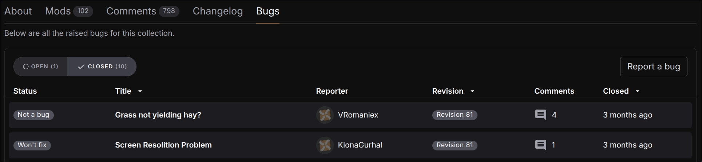

# External Notifications for Issue Tracker

- **Status:** Unknown

<figure markdown="span" class="annotate">
  
  <figcaption>Our Integrated Issue Tracker.</figcaption>
</figure>

!!! info "I want to know when a user reports an issue with a mod as soon as possible."

    So I can address it in ~~my typical time of 5 minutes~~ a timely manner to provide
    the best user support possible.

Notifications need to be sent to an external service I'm expected to monitor; such as  
Webhooks (Discord), Email, etc. without delay. I should not require to have
[nexusmods.com](https://nexusmods.com) open in a browser tab 24/7 to catch notifications.

My phone at 2am will not know that a user has reported an issue with a mod, *and that's no good!*

This feature exists for the forums (IPB), but not for the site. Sometimes forum posts arrive late
(over an hour), so the notifications must be prompt.
