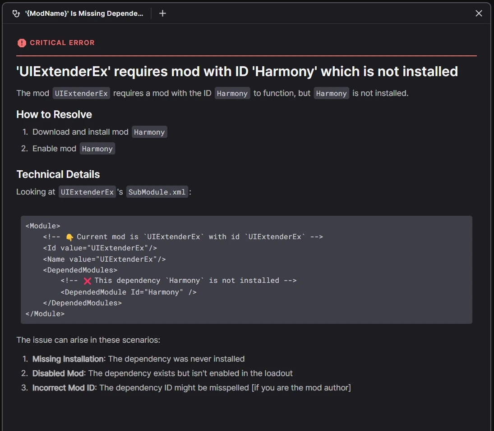

# Automatic Parsing of Mod Metadata in Uploads

!!! info "Certain mods use standardized modding frameworks with supporting metadata."

- **Status:** Unknown/Shortlisted 

=== "Stardew Valley (SMAPI)"

    ```
    📁 SpaceCore
        📁 docs
            📄 README.md
        📁 i18n
            📄 default.json
        📄 manifest.json
        📄 SpaceCore.dll
    ```

    Every mod contains a `manifest.json` file that describes the mod and its metadata.

    ```json
    {
        "UniqueID": "spacechase0.SpaceCore", // 👈 Unique Identifier
        "Name": "SpaceCore",
        "Author": "spacechase0",
        "Version": "1.28.0",
    }
    ```

=== "Bannerlord"

    ```
    📁 ImprovedGarrisons
        📄 SubModule.xml
        📁 bin
            📁 Win64_Shipping_Client
                📄 ImprovedGarrisons.dll
    ```

    Every mod contains a `SubModule.xml` file that describes the mod and its metadata.

    ```xml
    <Module>
        <Id>ImprovedGarrisons</Id> <!-- 👈 Unique Identifier -->
        <Name>Improved Garrisons</Name>
        <Version>1.0.0</Version>
        <Description>Improves the garrison system in Bannerlord.</Description>
        <!-- ... other fields -->
    </Module>
    ```

=== "Reloaded-II"

    ```
    📁 reloaded.sharedlib.hooks
        📁 x64
            📄 reloaded.sharedlib.hooks.dll
        📄 Preview.png
        📄 ModConfig.json
    ```

    Every mod contains a `ModConfig.json` file that describes the mod and its metadata.

    ```json
    { 
        "ModId": "reloaded.sharedlib.hooks", // 👈 Unique Identifier
        "ModName": "Reloaded II Shared Lib: Reloaded.Hooks",
        "ModAuthor": "Sewer56",
        "ModVersion": "1.16.3",
        // ... other fields
    }
    ```

This metadata can be extremely useful for improving the user experience for users on Nexus Mods.

## An Example: Dependency Resolution

<figure markdown="span">
  
  <figcaption>A diagnostic I implemented in the 'Nexus Mods App' for showing missing Bannerlord dependencies.</figcaption>
</figure>

Most games have mods which require additional dependencies, this usually comes in a form 
where downloading `Mod B` requires that you first download and enable `Mod A`.

In order to provide a good user experience and competitive edge, Nexus Mods should automatically parse
the metadata of each uploaded mod, and provide a way to ***search mods*** based on their metadata.

In the *Bannerlord* example above, the `SubModule.xml` file contains a `<Dependencies>` tag that
lists all the required mods. We know we need [Harmony](https://www.nexusmods.com/bannerlord/mods/2006),
however, we have no idea where to find `Harmony`, meaning that ***we cannot link to the mod***, or allow
premium users to download it automatically.

!!! failure "The user will manually have to 'google' the mod."

<center class="annotate">
    <div class="video-wrapper">
        <iframe width="1280" height="420" src="https://www.youtube.com/embed/GWD3GKfg530" frameborder="0" allowfullscreen></iframe>
    </div>
    <p><i>Automatic dependency resolution in my own Modding Framework.(1)</i><br/>
    <i>This is how easy going from 0 mods to mods should be.</i></p>
</center>

1. (Dependencies are automatically downloaded when user clicks 'Launch Application')

## Example: Mod Update Metadata

!!! info "Some modding frameworks support updating mods in a native way."

    This allows you to know which file is an update for which file automatically, plugs into 
    automatic dependency resolution, gives you direct download links, and more.

    !!! tip "Especially helpful if there's multiple mods on a mod page."

        A common user error on Nexus Mods is to upload a new version of a mod and forgetting to
        specify the last version of the new file.

!!! note "My automatic dependency resolution (shown above) is powered by the update system."

    So consider that an example 😉

Currently, adding update metadata to certain mods on Nexus Mods is a rather unintuitive process.

The problem is, you need to know the mod's `'modId'` and the game's `'gamedomain'` in order to
specify where a mod lives on the Nexus Mods.

<figure markdown="span" class="annotate">
  
  <figcaption>The `gamedomain` is 'site' and `modId` is '1026'.</figcaption>
</figure>

So the process of uploading a mod to the site is to actually make a blank mod page, that's unpublished (unlisted).
Then you need to *visit the unpublished mod page*, and copy the `gamedomain` and `modId` from the URL.

Afterwards, you need to go to your mod files, and paste in the relevant details, before finally
archiving your mod and uploading it to your mod page.

This is a very unintuitive process, and it is not clear to the user that they might need to do
this for the mods to correctly support updates in some modding frameworks.

***And if the user doesn't read the docs; that could mean broken mod updates.***

## How it's Currently Done

!!! tip "Certain limited number of modding frameworks already support automatic dependency resolution/location."

    However that comes at large upfront development cost for hobbyists doing stuff over weekends.

This usually involves having the communities running a bot that scrapes our site for mod metadata,
and then they store it in their own database; exposting the information through their own API.

One example of this is the [SMAPI Mod Database](https://smapi.io/). Another example is my own 
[Reloaded-II Index](https://github.com/Reloaded-Project/Reloaded-II.Index/blob/main/AllPackages.json.br) (does not currently index Nexus Mods).

Technically users are ***not*** supposed to be doing this, but it is the only way to get
the required metadata for some modding frameworks. So we as Nexus Mods have just been
looking the other way.

~~and for SMAPI we even gave them a private API to do it.~~