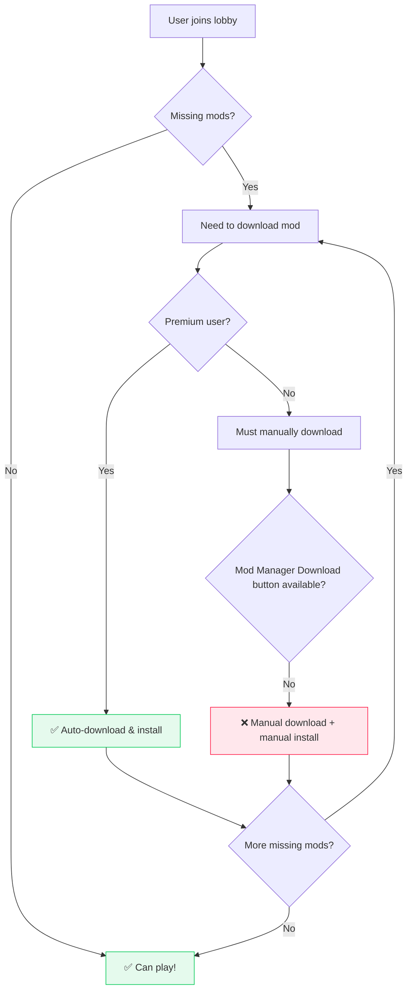

Stuff I took out from the other pages. This isn't as high quality as the rest of the docs, but I 
didn't want to throw it away.

## Modular Mods on Nexus Mods are difficult.

!!! warning "The user experience on Nexus Mods is difficult if you have many small mods."

    In an ideal world, mods would be small and modular, allowing users to pick and choose
    exactly what they want to install without needing to download a lot of junk they don't want in 
    multi-gigabyte files.
    
    However, Nexus Mods does not support this use case very well.

My past experiences have revolved around modding new games; treading new ground, reverse
engineering games which have not had any sort of modding community or tools available before.

I'll therefore use an example of one of these projects to illustrate the struggles of integrating
with Nexus Mods.

!!! example "Example: Online Multiplayer Mod"

    A few years ago, [I built exactly this](https://github.com/Sewer56/Riders.Tweakbox) for Sonic Riders (2006).

    <figure markdown="span" class="annotate">
        
        <figcaption>That one time I added Online Multiplayer to Sonic Riders (2006). [Random Alpha Gameplay Footage](https://youtu.be/9NIgQZhru_g?t=169) 
        First ever PC code mod: all rev. engineering, netcode etc. from scratch by yours truly.</figcaption>
    </figure>

So you have a mod that adds online multiplayer to a game, and you want to play with your friends.
Naturally, in order to play together, you must all have the same mods installed.

However, today doing this with Nexus Mods is ***difficult***.

### Joining Lobbies with Friends

!!! danger "Syncing Mods with Friends as a Free User Is Difficult"

    Non-premium users have to manually download and install mods, which is error-prone and time-consuming.

Suppose you want to join a *friend's multiplayer lobby* and
are missing some mods; so you need to sync up with them by downloading the same mods 
from Nexus Mods.

If the user is a free user, and they are missing 50 cosmetic mods, then for each download they will have to:

- Go to website.
- Click manual download button.
- Wait 5 seconds.
- Wait for download to finish.
- *Manually install the mod.* (⚠️ Error Prone!!)

Repeat for every mod.

### What People would need to do Today