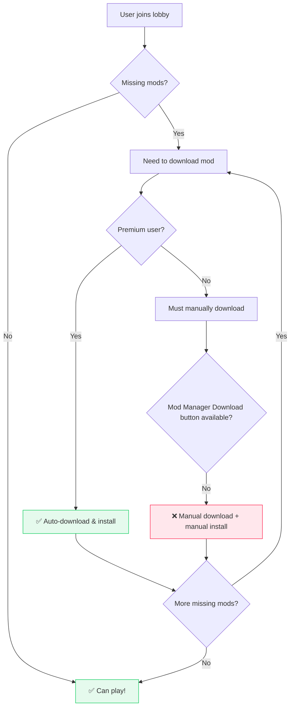

!!! note "I originally intended to take this out"

    This was part of another page, but I didn't want to part ways with the text.
    Although it's not as convincing or high quality as the rest of the wiki, I still think it
    has some value to it, so I decided to keep it here.

## Modular Mods on Nexus Mods are difficult.

!!! warning "The user experience on Nexus Mods is difficult if you have many small mods."

    In an ideal world, mods would be small and modular, allowing users to pick and choose
    exactly what they want to install without needing to download a lot of junk they don't want in 
    multi-gigabyte files.
    
    However, Nexus Mods does not support this use case very well.

My past experiences have revolved around modding new games; treading new ground, reverse
engineering games which have not had any sort of modding community or tools available before.

I'll therefore use an example of one of these projects to illustrate the struggles of integrating
with Nexus Mods.

!!! example "Example: Online Multiplayer Mod"

    A few years ago, [I built exactly this](https://github.com/Sewer56/Riders.Tweakbox) for Sonic Riders (2006).

    <figure markdown="span" class="annotate">
        
        <figcaption>That one time I added Online Multiplayer to Sonic Riders (2006).<br/>[Random Alpha Gameplay Footage](https://youtu.be/9NIgQZhru_g?t=169)<br/>
        First ever PC code mod: all rev. engineering, netcode etc. from scratch by yours truly.</figcaption>
    </figure>

So you have a mod that adds online multiplayer to a game, and you want to play with your friends.
Naturally, in order to play together, you must all have the same mods installed.

However, today doing this with Nexus Mods is ***difficult***.

### Modding a Racing Game

!!! tip "Racing games are naturally modded in a more modular, granular way compared to RPGs."

Unlike RPGs like Skyrim or Cyberpunk, which feature interconnected worlds where it's important to maintain
overall 'consistency' or 'coherency', games in the racing genre are often more ***compartmentalized*** (chunked up into pieces).
One race you could be driving a panda on the moon, and the next you could be racing a hoverboard in a futuristic city.

Therefore, mods are created at a more granular level as mod authors aim to add or replace a single piece of content.
For instance, in a racing game you would typically see:

- **Individual vehicles**: 1 Mod for each car, bike, or hoverboard
- **Individual tracks**: 1 Mod for each racing track
- **Individual skins**: 1 Design for a Vehicle or character as a single mod
- **Individual music tracks**: 1 Custom song for the jukebox (or a specific stage) as its own mod

This natural modularity means users can curate their exact preferences - install 3 specific hoverboards they love,
5 tracks that match their skill level, and skip everything else.

### Hosting a Multiplayer Lobby

!!! info "In a multiplayer game with mod support, the host's mod setup are essentially the server settings."

    Whatever the host has installed, the players must also have installed to join their lobby.

The host of a multiplayer lobby wants to have explicit control over how the game is played.

This should be as simple as possible for a user to do, so ideally the user should just click 'Create Lobby'
and things should 'just work'.

*However it isn't so simple on Nexus Mods.*

### Joining Lobbies with Friends

!!! danger "Syncing Mods with Friends as a Free User Is Difficult"

    Non-premium users have to manually download and install mods, which is error-prone and time-consuming.

Suppose you want to join a *friend's multiplayer lobby* and
are missing some mods; so you need to sync up with them by downloading the same mods 
from Nexus Mods.



If the user is a free user, and they are missing 50 cosmetic mods, then for each download they will have to:

<div class="annotate" markdown>
- Go to website.
- Click manual download button.
- Wait 5 seconds.
- Wait for download to finish.
- Manually install the mod.(1) (⚠️ Error Prone!!)
</div>

1. By hand, from the `.zip`, `.rar`, or `.7z` file; because the game is not supported by Vortex,
   you are not allowed to have a `Mod Manager Download` button.

Repeat for every mod.

This does not mesh well with a modular modding approach, where users may have dozens of small mods
to sync up with the host. A free user may be missing 150 mods consisting of small, tiny pieces of content
such as tracks and skins. The size of the content could total to only 300MB, but the time to complete the
download and install process could take over an hour.

### What People Have to do Today

!!! info "Mod authors have to bundle their mods together into large packages."

    This is so that users can download a single file and install it, rather than having to
    manually download and install dozens of small mods.

    !!! note "This also is sometimes a result of poor or missing modding tooling."

        Sometimes mod authors make bundles due to games lacking good mod manager or mod merging integration.

        *This can make installing mods harder*, so authors bundle their mods together
        to make it easier for users to install.(1)
        { .annotate }

        1. This is part the reason why I created the [Reloaded-II Modding Framework](https://reloaded-project.github.io/Reloaded-II/) years ago;
           and I've been working hard on a successor, [Reloaded3](https://reloaded-project.github.io/Reloaded-III/).<br/><br/>
           I wanted to make it easier for people to bring modding experiences to new games, which otherwise might not get the love they truly deserve.<br/><br/>
           So I built an easy to use 'universal modding framework' that can truly be plugged in 'anywhere' into 'any game' out of the box without any technical skills.

        (Just thought I'd note this, even if a bit off-topic.)

!!! warning "And some people just may use a website other than Nexus Mods for hosting their stuff."

As a result, you now get more 'monolithic' mods in the style of:

```
❌ "Ultimate Racing Pack V2" (2.5GB)
    ├── 20 hoverboards (you only want 3 of them)
    ├── 15 stages (you hate 8 of them)  
    ├── 30 character skins (toilet style, not your thing)
    └── 12 music tracks (too loud/obnoxious)
```

And when the mod pack is updated, you might get:

```
❌ "Ultimate Racing Pack V3" (3.0GB)
    ├── 25 hoverboards
    ├── 18 stages
    ├── 30 character skins
    └── 12 music tracks
```

This makes it difficult for everyone:

- ***Nexus pays more in bandwidth costs***, because users need to make unnecessary downloads.
- ***Changing server settings as host is hard:*** Hosts have to manually produce their 'bundles' of mods, uploads are slow and time consuming.
- ***Players have to download large packages:***, even if they only want a small subset of the content.

In addition, players lose the 'modular' aspect of modding, they no longer have an easy way to pick and choose
exactly what they want to use.

### Collections to the Rescue?

!!! question "Well, we have a mechanism for specific mod setups called 'Collections'"

    Couldn't we just use that to solve this problem?

1. **Initial Install is Painful**: Free users may still need over an hour to set up their mods (just to join a friend's lobby).
2. **Vortex Lock-in**: Collections are [only available for games supported by Vortex](./collections-for-external-software.md).
3. **Limitations of Vortex**: Vortex has limitations such as not being cross-platform (not available on Linux or Mac).

Unfortunately, collections are not a perfect solution. While they alleviate some of the UX issues
around syncing your mod setup to a host, they do not solve the remaining underlying problems.

### Solutions?

I am in no place to offer a concrete solution to this problem of many small mods with a combined file size.

Unfortunately, sending free users to the Nexus Mods website is part of the core monetization strategy of the
website; and I lack needed information to make informed guesses around operating costs, etc.

I've previously suggested sending people to the site `every X megabytes` of downloads, 