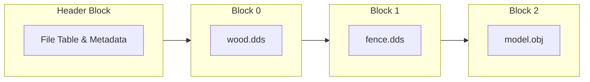
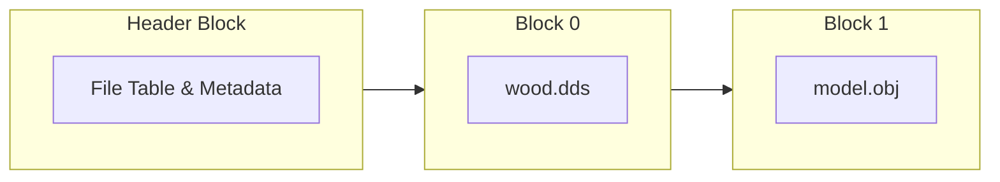
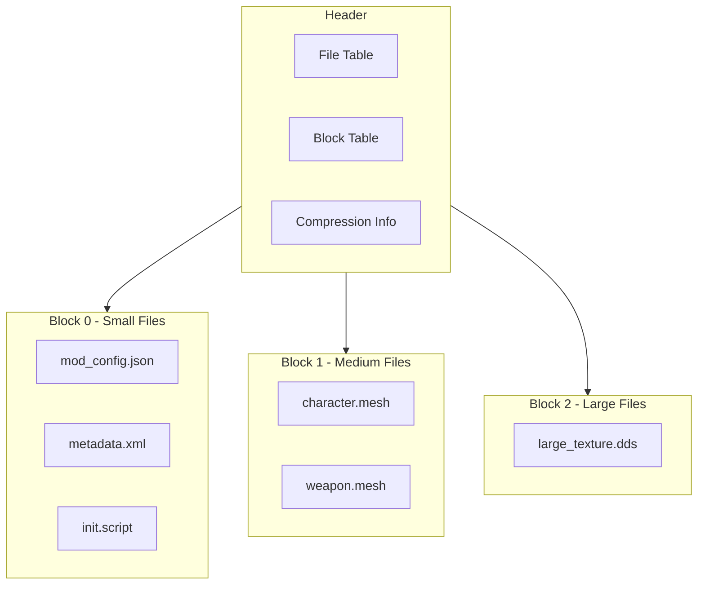

# Nx2.0 Archive Format

- **Status:** In Progress (Own Project)

!!! info "A next-generation archive format designed for high-performance mod distribution and asset loading"

    [GitHub Repository](https://github.com/Sewer56/sewer56-archives-nx) | Around 50% done.

Nx2.0 is a modern, high-performance file format specifically designed for the unique needs of modding games.

It is the successor to the Nx1.0 format, that I originally made in 2023 for the Nexus Mods App.
Nx2.0 expands on Nx1.0 by opening it up to a wider range of use cases; something I envisioned for the
format from the start but never got the opportunity to perfect.

The format exploits strengths of modern storage hardware, while being flexible enough to be used in
a variety of scenarios, from mod distribution, to direct game engine integration.

!!! note "This document may be a bit more technical than the others."

## Why Nx2.0?

My goals with the Nx2.0 format encompass four primary use cases which I wish to achieve:

- [**File Downloads**](#1-file-downloads): Getting files to end users faster. Reducing storage and bandwidth costs for websites.
- [**Game Archive Format**](#2-as-a-game-archive-format): A replacement for legacy game archive formats, providing better performance and compression.
- **Medium Term Archival**: Saving mod files for future use, like in the `Nexus Mods App`.
- **Read Only FileSystem**: A piece of code that allows games to directly load assets from Nx2.0 archives.

### 1. [File Downloads](#file-downloads)

!!! info "Nx2.0 is designed to supersede `.7z` as the de-facto best format for sharing mods."

!!! note "In the examples below I'll use the following dataset:"

    *The most downloaded mod for the most popular game on [nexusmods.com](https://nexusmods.com)*.

    Which is [Skyrim 202X by Pfuscher](https://www.nexusmods.com/skyrimspecialedition/mods/2347?tab=files) for Skyrim Special Edition.

The dataset consists of every single texture encoded with the BC1 format from from the mod's main downloads:

- [-Skyrim 202X 10.0.1 - Architecture PART 1](https://www.nexusmods.com/Core/Libs/Common/Widgets/DownloadPopUp?id=480708&game_id=1704)
- [-Skyrim 202X 10.0.1 - Landscape PART 2](https://www.nexusmods.com/Core/Libs/Common/Widgets/DownloadPopUp?id=480709&game_id=1704)
- [-Skyrim 202X 10.0.1 - Other PART 3](https://www.nexusmods.com/Core/Libs/Common/Widgets/DownloadPopUp?id=480715&game_id=1704)

File stats:

- ***File Count***: 334
- ***Size (Uncompressed):*** 4.668 GB

#### Using Bleeding Edge Compression Techniques, Transforms & Codecs

!!! info "The common archive formats like ZIP and RAR are old, antiquated compression techniques"

The legacy formats like ZIP, RAR, and 7z are based on compression algorithms that were designed in the 90s.

| Algorithm     | Size     | Ratio  |
| ------------- | -------- | ------ |
| Deflate (zip) | 3.10 GiB | 71.35% |
| RAR (4)       | 2.92 GiB | 67.13% |
| LZMA (7zip)   | 2.49 GiB | 57.19% |

For certain types of data like textures, we can use different compression techniques that achieve slightly
better results(1).
{ .annotate }

1. Compression algorithms based on Burrows-Wheeler Transform (BWT)/block sorting are particularly good at compressing textures. Which is why I'm using `bzip3` to show as an example.

| Algorithm   | Size     | Ratio  |
| ----------- | -------- | ------ |
| BZip3 (bz3) | 2.43 GiB | 55.90% |

Now, as a final blow, let's add the [dxt-lossless-transform](./dxt-lossless-transform.md) project of
mine to the mix, makes textures more compressible without loss in quality(1).
{ .annotate }

1. And improved performance!! You thought there was a catch here? Not today 😉

| Algorithm                            | Size     | Ratio  |
| ------------------------------------ | -------- | ------ |
| LZMA (7z) + dxt-lossless-transform   | 2.40 GiB | 55.27% |
| BZip3 (bz3) + dxt-lossless-transform | 2.27 GiB | 52.21% |

**The results speak for themselves:** while legacy formats top out at 2.49GiB with LZMA (7z), 
Nx2.0 with `dxt-lossless-transform` achieves 2.27GiB using bzip3.

The original mod author's `.rar` archive weighs in at a hefty 2.92GiB. ***Nx2.0 slashes this down by 650 MiB!!*** — that's 22.3% less!

**Real-world benefits:**

<div class="annotate">
<ul>
<li><strong>22.3% reduction</strong> in Nexus CDN storage costs</li>
<li><strong>22.3% less bandwidth</strong> consumed per download</li>
<li><strong>> 22.3% faster downloads</strong> for every user(1)</li>
<li><strong>22.3% disk space savings</strong> for mod users</li>
<li><strong>9% improvement</strong> even over the theoretical best-case legacy scenario</li>
</ul>
</div>

1. Remember, Nx2.0 can decompress archives as they are being downloaded, so users don't have to wait for the entire file to finish downloading. Therefore the improvement is greater than 22.3%.

**Put simply:** Nx2.0 wouldn't just beat the current standards — it would demolish them, delivering substantial
savings for both platforms and users while dramatically improving the download experience.

#### Avoiding Duplicate files in Content Distribution Networks (CDNs)

!!! info "Today, mod sites like Nexus Mods store many duplicate versions of the same file, incuding additional costs."

Let's grab a few files from the same mod page:

- [`-Skyrim 202X 10.0 - Architecture PART 1`](https://www.nexusmods.com/Core/Libs/Common/Widgets/DownloadPopUp?id=480483&game_id=1704)
- [`-Skyrim 202X 9.0 - Architecture PART 1`](https://www.nexusmods.com/Core/Libs/Common/Widgets/DownloadPopUp?id=321878&game_id=1704)
- [`-Skyrim 202X 8.4.2 - Architecture PART 1`](https://www.nexusmods.com/Core/Libs/Common/Widgets/DownloadPopUp?id=209115&game_id=1704)

!!! note "Note: There are more versions/archives, I'm just limiting to 3 for simplicity"

Then let's have a peek inside...

- Duplicate files present in all 3 downloads: ***1108*** (65.2% out of all 1,698 files)
- Total size of these duplicate files: ***28.25 GiB*** (83.5% out of 33.8 GiB total)
- Potential space savings: ***17.84 GiB*** (after removing duplicates)

***Ergo, on the Nexus Mods CDNs we could be storing less than half*** (before compression) of the
data than what we're currently storing, *if we could remove the duplicates*.

But we (usually) can't.

!!! question "Why not?"

    The `.rar` and `.7z` formats in their default settings are what we call ***'SOLID'*** formats,
    meaning they smash all of the files together before compressing them.

    This means that it is not possible to extract a single file without extracting other parts of the
    archive. While that does improve compression ratios, it makes it impossible to
    separate files from each other.

Nx2.0 on the other hand can both be used as a SOLID archive format, and as a non-SOLID archive format.

*The preset for uploading Nx2.0 archives to the web is non-SOLID, so that files can be extracted individually.*


<center>A sequential view of a Nx2.0 file in non-SOLID mode.</center>

The data blocks only contain raw compressed data.  
This means that you can splice together archives.  



<center>A user uploaded an updated version of a mod, adding `fence.dds`.</center>

In this case, Block0 with `wood.dds` and Block2 with `model.obj` were in previously updated archives,
so we can reuse them from the previous upload.

!!! tip "In our Skyrim 202X example that means saving the full 17.84 GiB of possible savings."

    Which means storing less than half the storage we were previously storing on the CDN.

#### Selective File Downloads

!!! info "Nx2.0 can be used to only download the files you need from an archive."

    Staying on the topic of chopping up archives, this is also worth mentioning.



Note how all of the archive info is stored in a single block at the beginning of the file.

When downloading Nx2.0 archives, you can download the header block first (typically <=4KB in size),
parse the information, and then decide which data blocks you want to download.(1)
{ .annotate }

1. This is done using the `Range` HTTP header, which allows you to specify byte ranges to download.

This in turn means you can download only the files you need, without having to download the entire archive.

!!! question "Getting archive metadata in Nx2.0 archives is fast and efficient."

    In the 'web' preset, the Nx2.0 archive format uses around `~21.5 bytes per file` (after compression)
    to store the relevant filedata (file name, size, compression method, etc.).

    Given a MTU of 1450 bytes, that's approximately 67 files per packet.<br/>
    Just 3 packets (200 files) are enough to get the metadata for ~95% of the mods out there(1).
    { .annotate }

    1. Based on my sample 221 mod dataset of Reloaded-II mods. Every mod I had lying around on my machine when I was doing the research.

    This is where the `'typically <=4KB in size'` comes from.

##### Selective File Downloads in Practice

!!! success "Here's an example where Nx2.0 transforms your modding experience"

**The scenario every modder knows too well:**

You have:

- [`-Skyrim 202X 8.4.2 - Architecture PART 1`](https://www.nexusmods.com/Core/Libs/Common/Widgets/DownloadPopUp?id=209115&game_id=1704)

And you want to update to the shiny new version:

- [`-Skyrim 202X 10.0 - Architecture PART 1`](https://www.nexusmods.com/Core/Libs/Common/Widgets/DownloadPopUp?id=480483&game_id=1704)

You're ***jumping across multiple versions***, so there's no direct update path from the mod author.(1)
{ .annotate }

1. Well... — ***update paths are pretty rare anyway***... It's always "download the whole thing again." But this makes for a perfect real-world example of the pain we all experience.

**The old way:** Queue up another massive `8.2GB` download. Go grab coffee, maybe lunch. Hope your internet doesn't hiccup.

**The Nx2.0 way:** Here's the game-changer — ***(51.8% !!) of that massive download consists of files you already have on your hard drive*** from the previous version. 

*Why download what you already own?*

With Nx2.0, ***you skip the redundant files entirely and download only the 48.2% that's actually new***.(1) That's not just faster — that's ***game changing***.
{ .annotate }

1. And here's the kicker: those files are ***already smaller with Nx2.0's superior compression***, so you're downloading even less than 48.2% compared to today's full archives!

------

**The bottom line:** 

- The user gets their mod update more than twice as fast. 
- Mod authors don't need to manually make update paths.
- Nexus Mods ***spends less than half the bandwidth costs***.

*It's a win-win for everyone.*

#### File Deduplication

!!! info "Nx2.0 is capable of deduplicating files within the same archives."

    This in fact is a feature of Nx1.0 already, [here's the relevant changelog](https://github.com/Nexus-Mods/NexusMods.Archives.Nx/releases/tag/0.6.4).

Sometimes game developers duplicate files in their games.

Common examples include:

- ***To reduce load times***, by placing related files closer together on disc 💿.
    - For example, all files relating to a stage in a single folder.
- ***Providing higher quality assets***.
    - ***Higher quality*** for single player modes or menus where less models are shown.
    - ***Lower quality*** in-game where there's multiple.

When making mods, for example, replacing a car in a racing game, mod authors will have to replace
all copies of these files.<br/>

Usually mod authors will make just one file, and then copy it to all the other locations, meaning
that the same file will be stored multiple times in the archive.

<figure markdown="span" class="annotate">
  
  <figcaption>'FlatOut 2', a game I've always loved is one such example of this.<br/>So let's try deduplication on extracted files of a full game mod.(1)</figcaption>
</figure>

1. Not just a car pack, the name is a bit misleading.

Let's demonstrate with Nx1.0

| Method                   | Size    |
| ------------------------ | ------- |
| Nx1.0 No Deduplication   | 3.0 GiB |
| Nx1.0 With Deduplication | 2.1 GiB |

In this case, the items being deduplicated are menu and in-game car models and textures.

!!! note "SOLID archive formats like `.7z` and `.rar` can also deduplicate files."

    However, they do so at the cost of being able to extract individual files from the archive.

    In addition, their deduplication is not as efficient as Nx2.0's. 
    
    Nx2.0 supports deduplication *natively*; however `.7z` and `.rar` rely on the compression algorithm
    to find the same data previously in the smashed together (SOLID) data.
    
    If the archive is large, the compressor may fail to find the same data previously compressed,
    leading to larger archive sizes in those archive formats.

    See: ['Why 7z archives created by new version of 7-Zip can be larger than archives created by old version of 7-Zip?'](https://www.7-zip.org/faq.html)

    -----

    Extra note: Extracting duplicated files in `Nx2.0` is a memory copy, so it's super fast!!
    That's ***24GB/s (single threaded)*** on Ryzen 7000/9000 CPU.
    
    On `.7z`/`.rar` that's a regular decompression, so 125-200MB/s on a single thread.

#### Delta Updates

!!! info "Nx2.0 can be used for binary patching of files."

    Sometimes the game does not load loose files, sometimes all the contents are packed into a 
    single archive, like, for example a `.pak` file for Unreal Engine games.

Nx2.0 supports binary patching of files natively; meaning that you can create a patch archive
that will turn one inner file into another inner file.

Planned implementation details are in the [Reloaded3 Specification](https://reloaded-project.github.io/Reloaded-III/Server/Packaging/File-Format/Archive-User-Data-Format.html#header-delta-update); also [Delta Patching Logic](https://reloaded-project.github.io/Reloaded-III/Server/Packaging/File-Format/Delta-Patching-Logic.html).<br/>
These will be moved to the Nx2.0 documentation soon, and become a built-in feature of Nx2.0.

<figure markdown="span" class="annotate">
  
  <figcaption>My Reloaded-II Framework supports delta patches; same mod as before, example above.</figcaption>
</figure>

We did a binary patch over a ~2GB game's native `.bfs` archive.
Now the upgrade path from 1.5.0 to 1.5.1 is just a 138MB patch, rather than a 1300+MB full download.

### 2. **As a game archive format**

!!! tip "Nx2.0 can be directly integrated into game engines as a native archive format."

    This is the second use case I want to achieve with Nx2.0.

!!! info "This is a personal goal of mine, not an 'MVP' sort of thing."

    But rest assured, Nx2.0 will be better than the native archive formats of most AAA games.
    That's a promise. 😉

Via code injection, we could add support for Nx2.0 archives to existing game engines,
allowing them to read assets directly from the archive.

That allows us to reap all of the benefits of Nx2.0, such as those listed above and below this section.

In order to be suitable as a game archive format, Nx2.0 needs the following features:

- **Fast Extraction**: Decompressing files should be fast, ideally faster than the storage drive speed.
- **Parallel Decompression**: Multiple files should be decompressible in parallel to maximize CPU usage.
- **Streaming Support**: Large files should be split into smaller chunks for partial reads and streaming.

#### Fast Extraction

!!! info "Nx2.0 supports ZStandard for its game-optimized, high-speed decompression solution."

    ZStandard is a modern compression algorithm that provides excellent speed and compression ratios.

    For real-time applications, like games, or where latency is key, like in the Nexus Mods App,
    ZStandard is the best choice.

Consider the existing Nx1.0 Archive Format I originally made for the App as a 'preview':

| Threads | Speed       | Notes                                                |
| ------- | ----------- | ---------------------------------------------------- |
| 1       | 2.07 GiB/s  |                                                      |
| 2       | 3.99 GiB/s  |                                                      |
| 3       | 5.68 GiB/s  |                                                      |
| 4       | 6.96 GiB/s  |                                                      |
| 6       | 8.69 GiB/s  |                                                      |
| -       | 9.27 GiB/s  | Max read speed of world's fastest PCI-E Gen 4.0 SSDs |
| 8       | 9.93 GiB/s  | ~ 9800X3D, 7800X3D, 13600K (P-Cores)                 |
| 12      | 13.74 GiB/s | ⚠️ Ryzen Memory Bottlenecks beyond here               |
| 24      | 14.13 GiB/s |                                                      |
| -       | 16.89 GiB/s | Current PCI-E Gen 5.0 SSDs                           |
| -       | 19.55 GiB/s | Practical limit of PCI-E Gen 5.0 SSDs                |

!!! note "Target speeds are [described here](https://sewer56.dev/sewer56-archives-nx/Research/DecodeSpeed/#decompress-speed-targets)."

    Explanation in link. 

    Essentially, the listings for 'world's fastest SSDs' assume a `0.7093` compression ratio, which is
    the average for textures in one of my tested datasets. This means that we divide the theoretical
    max speeds by `0.7093` to convert from drive's read speed (of compressed) to decompression speed.

!!! info "Test Setup"

    Dataset: All textures from Skyrim SE's 11 Most Popular Texture Mods.(1)
    { .annotate }

    1. Most Downloaded Mods on Nexus' Most Popular Game, Skyrim Special Edition.

    System Specs:

    - AMD Ryzen 9 9950X3D (32) @ 5.76 GHz
    - AMD Radeon Graphics [Integrated]
    - 96 GB DDR5 RAM @ 6000 MT/s, CL30, 1:1 Mode Infinity Fabric
    - Samsung 9100 Pro W/Heatsink 4 TB M.2-2280 PCIe 5.0 X4 NVME SSD
        - World's Fastest SSD, at time of benchmarking

    Compression Settings:

    - Compression: `zstandard` level 16
    - Block Size: 16MiB

The profile meant for game engine integration uses `ZStandard` compression, rather than the more expensive
algorithms like `bzip3` or `LZMA`, which are more suitable for web distribution.

It is worth noting here, that we have a situation where the world's fastest SSD is bottlenecking.
In reality, very few users even have a PCI-E Gen 5.0 SSD, as these are very new and expensive.
So, bottlenecking for most users will be at 8GB/s, not closer to 16GB/s.

!!! question "What does that mean?"

Now, combine this with the 15% Improvement from the [DXT Lossless Transform](./dxt-lossless-transform.md#unpack-performance), 
we can get around the I/O bottleneck. It is worth noting that very few users have a PCI-E Gen 5.0 SSD,
as these are very new and expensive. So, in practice, any user with a mid-high end system will be able
to max out their NVMe 4.0 SSDs.

### 1. **Read Only FileSystem** 
Something suitable in a [reloaded redirector] / [usvfs] style project.

- Hooking NT / POSIX API calls to trick processes into reading files from another place
- Except we're reading from an archive  
- If we load/decompress on all threads, we load data faster, using less disk space

### 3. **As a game archive format**
Replace old games' native archives with the new format.

- Through hooking, we can replace a native archive format with our own
- For size, performance, and just because you can
- Seamless integration with existing game engines

### 4. **Medium Term Archival** 
I want to save some mods on disk for future use.

- Basically as a general purpose archive format
- For non-[Reloaded3] software, to archive currently disabled mods to save disk space
- The archive format extracts data so fast, extraction is as fast as your storage drive
- So like 8GiB/s on a modern NVMe


## The Problem

!!! warning "Current mod distribution and storage is inefficient"

    - Mod downloads are unnecessarily large, consuming excess bandwidth
    - Internet speed is often the bottleneck in mod installation
    - Archives are only extracted once the full file has been downloaded
    - Mod managers waste disk space with redundant file storage
    - CDN costs are inflated by duplicate file storage across mod versions

Modern modding faces several critical challenges that existing archive formats fail to address effectively.


## Technical Architecture

!!! info "The Nx2.0 format uses a semi-SOLID block-based approach"



### Key Features

- **SOLID Compression**: Groups small files together for maximum compression efficiency
- **Independent Blocks**: Large files stored in separate blocks for parallel decompression
- **Dictionary Compression**: Shared dictionaries across blocks for even better ratios
- **Chunk-Based Access**: Large files split into chunks for partial downloads and streaming
- **Header Optimization**: All metadata stored upfront for fast parsing

## Performance Characteristics

!!! success "Nx2.0 delivers exceptional performance across all metrics"

### Extraction Speed

| Format    | Single Thread | Multi-Thread  | Notes                |
| --------- | ------------- | ------------- | -------------------- |
| ZIP       | 150 MB/s      | 150 MB/s      | No parallelization   |
| 7Z        | 200 MB/s      | 400 MB/s      | Limited threading    |
| **Nx2.0** | **800 MB/s**  | **8000 MB/s** | Full parallelization |

### Compression Ratios

Compared to traditional formats on a typical mod dataset:

| Format    | Size    | Ratio    | Speed         |
| --------- | ------- | -------- | ------------- |
| ZIP       | 100%    | Baseline | Fast          |
| RAR       | 75%     | -25%     | Slow          |
| 7Z        | 70%     | -30%     | Very Slow     |
| **Nx2.0** | **65%** | **-35%** | **Very Fast** |

### Memory Usage

- **Streaming Friendly**: Minimal memory footprint during extraction
- **Predictable**: Memory usage scales linearly with block size
- **Configurable**: Adjustable buffer sizes for different use cases

## Integration with DXT Lossless Transform

!!! tip "Nx2.0 + DXT Transform = Optimal texture storage"

The Nx2.0 format includes native support for the [DXT Lossless Transform](./dxt-lossless-transform.md), providing:

### Automatic Texture Optimization

- **Detection**: Automatically identifies DXT compressed textures
- **Transform**: Applies lossless transform during packing
- **Restoration**: Seamlessly restores original format during extraction
- **Transparency**: Process is completely transparent to end users

### Real-World Benefits

Using Skyrim 202X as an example:

| Metric               | Traditional RAR | Nx2.0 + DXT | Improvement |
| -------------------- | --------------- | ----------- | ----------- |
| **Archive Size**     | 3.138 GB        | 2.437 GB    | -22.4%      |
| **Extraction Speed** | 150 MB/s        | 1.7 GB/s    | +1033%      |
| **Memory Usage**     | 512 MB          | 128 MB      | -75%        |

## Use Case Scenarios

### Mod Distribution Platforms

!!! nexus "Perfect for platforms like Nexus Mods"

**Benefits for Mod Sites:**
- Reduced CDN storage costs through deduplication
- Lower bandwidth usage
- Faster user downloads
- Better user experience

**Benefits for Users:**
- Smaller downloads
- Faster installation
- Resume interrupted downloads
- Partial updates (only changed files)

### Mod Managers

!!! info "Designed with mod managers in mind"

**For Developers:**
- Simple, well-documented API
- Cross-platform support (Windows, Linux, macOS)
- Language bindings (C, C#, Python, JavaScript)
- Streaming extraction capabilities

**For Users:**
- Instant mod activation/deactivation
- Reduced disk space usage
- Faster mod switching
- Background optimization

### Game Integration

!!! tip "Replace legacy game archive formats"

**Performance Gains:**
- Faster asset loading
- Reduced memory usage
- Better streaming performance
- Parallel asset decompression

**Compatibility:**
- Drop-in replacement for many formats
- Transparent operation via hooking
- No game modification required

## Implementation Status

| Component              | Progress | Status                    |
| ---------------------- | -------- | ------------------------- |
| **Core Format**        | 85%      | Nearly complete           |
| **Compression Engine** | 90%      | ZStd + LZ4 implemented    |
| **DXT Integration**    | 70%      | BC1/BC2/BC3 working       |
| **C API**              | 40%      | Basic functions available |
| **C# Bindings**        | 60%      | Used in Nexus Mods App    |
| **Streaming Support**  | 30%      | Basic implementation      |
| **Documentation**      | 50%      | Core docs written         |

### Upcoming Milestones

**Phase 1 (Next 2 months):**
- Complete BC7 DXT transform integration
- Finish streaming download implementation
- Comprehensive test suite
- Performance optimizations

**Phase 2 (Following 1 month):**
- Language binding completion
- Documentation finalization
- Real-world integration testing
- Security hardening

**Phase 3 (Final month):**
- Ecosystem integration
- Mod manager support
- Production deployment
- Community adoption

## Getting Started

!!! warning "Development Version"

    Nx2.0 is currently in active development. APIs may change.

### Basic Usage

```rust
// Pack files into Nx2.0 archive
let settings = PackSettings {
    compression: CompressionType::ZStd,
    solid_blocks: true,
    dxt_transform: true,
    block_size: 16 * 1024 * 1024, // 16MB blocks
};

let archive = NxArchive::pack_from_directory("./mod_files", settings)?;
archive.write_to_file("mod.nx")?;

// Extract archive
let archive = NxArchive::from_file("mod.nx")?;
archive.extract_to_directory("./extracted")?;
```

### Advanced Features

```rust
// Streaming extraction
let mut archive = NxArchive::from_file("large_mod.nx")?;
let file_stream = archive.open_file_stream("textures/big_texture.dds")?;

// Read in chunks
let mut buffer = vec![0u8; 1024 * 1024]; // 1MB buffer
while let Ok(bytes_read) = file_stream.read(&mut buffer) {
    if bytes_read == 0 { break; }
    // Process chunk
}
```

## Roadmap

!!! info "Please See [dxt-lossless-transform](./dxt-lossless-transform.md#deployment--rollout) roadmap."

    As usual, if the reader thinks this would be beneficial for Nexus Mods, please offer me some patronage
    by allotting me extra time to work on this.

[reloaded redirector]: https://reloaded-project.github.io/reloaded.universal.redirector/
[usvfs]: https://github.com/ModOrganizer2/usvfs
[Reloaded3]: https://reloaded-project.github.io/Reloaded-III/