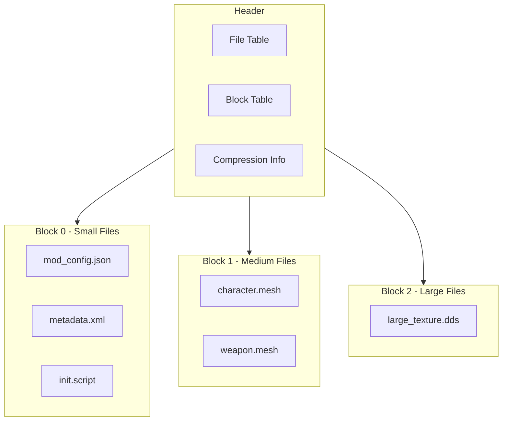

# Nx2.0 Archive Format

- **Status:** In Progress (Own Project)

!!! info "A next-generation archive format designed for high-performance mod distribution and asset loading"

    [GitHub Repository](https://github.com/Sewer56/sewer56-archives-nx) | Around 50% done.

Nx2.0 is a modern, high-performance file format specifically designed for the unique needs of modding games.

It is the successor to the Nx1.0 format, that I originally made in 2023 for the Nexus Mods App.
Nx2.0 expands on Nx1.0 by opening it up to a wider range of use cases; something I envisioned for the
format from the start but never got the opportunity to perfect.

The format exploits strengths of modern storage hardware, while being flexible enough to be used in
a variety of scenarios, from mod distribution, to direct game engine integration.

!!! note "This document may be a bit more technical than the others."

## Why Nx2.0?

My goals with the Nx2.0 format encompass four primary use cases which I wish to achieve:

- [**File Downloads**](#1-file-downloads): Getting files to end users faster. Reducing storage and bandwidth costs for websites.
- **Game Archive Format**: A replacement for legacy game archive formats, providing better performance and compression.
- **Medium Term Archival**: Saving mod files for future use, like in the `Nexus Mods App`.
- **Read Only FileSystem**: A piece of code that allows games to directly load assets from Nx2.0 archives.

### 1. [File Downloads](#file-downloads)

!!! info "Nx2.0 is designed to supersede `.7z` as the de-facto best format for sharing mods."

!!! note "In the examples below I'll use the following dataset:"

    *The most downloaded mod for the most popular game on [nexusmods.com](https://nexusmods.com)*.

    Which is [Skyrim 202X by Pfuscher](https://www.nexusmods.com/skyrimspecialedition/mods/2347?tab=files) for Skyrim Special Edition.

The dataset consists of every single texture encoded with the BC1 format from from the mod's main downloads:

- [-Skyrim 202X 10.0.1 - Architecture PART 1](https://www.nexusmods.com/Core/Libs/Common/Widgets/DownloadPopUp?id=480708&game_id=1704)
- [-Skyrim 202X 10.0.1 - Landscape PART 2](https://www.nexusmods.com/Core/Libs/Common/Widgets/DownloadPopUp?id=480709&game_id=1704)
- [-Skyrim 202X 10.0.1 - Other PART 3](https://www.nexusmods.com/Core/Libs/Common/Widgets/DownloadPopUp?id=480715&game_id=1704)

File stats:

- ***File Count***: 334
- ***Size (Uncompressed):*** 4.668 GB

#### Using Bleeding Edge Compression Techniques, Transforms & Codecs

!!! info "The common archive formats like ZIP and RAR are old, antiquated compression techniques"

The legacy formats like ZIP, RAR, and 7z are based on compression algorithms that were designed in the 90s.

| Algorithm     | Size     | Ratio  |
| ------------- | -------- | ------ |
| Deflate (zip) | 3.10 GiB | 71.35% |
| RAR (4)       | 2.92 GiB | 67.13% |
| LZMA (7zip)   | 2.49 GiB | 57.19% |

For certain types of data like textures, we can use different compression techniques that achieve slightly
better results(1).
{ .annotate }

1. Compression algorithms based on Burrows-Wheeler Transform (BWT)/block sorting are particularly good at compressing textures. Which is why I'm using `bzip3` to show as an example.

| Algorithm   | Size     | Ratio  |
| ----------- | -------- | ------ |
| BZip3 (bz3) | 2.43 GiB | 55.90% |

Now, as a final blow, let's add the [dxt-lossless-transform](./dxt-lossless-transform.md) project of
mine to the mix, makes textures more compressible without loss in quality(1).
{ .annotate }

1. And improved performance!! You thought there was a catch here? Not today 😉

| Algorithm                            | Size     | Ratio  |
| ------------------------------------ | -------- | ------ |
| LZMA (7z) + dxt-lossless-transform   | 2.40 GiB | 55.27% |
| BZip3 (bz3) + dxt-lossless-transform | 2.27 GiB | 52.21% |

With the legacy formats, our best possible scenario was 2.49GiB with LZMA (7z).  
With the new compression format, and the `dxt-lossless-transform`, we can achieve 2.27GiB with bzip3.

The original archive by the mod author was uploaded with `.rar`.
This means that in Nx2.0 (BZip3 + dxt-lossless-transform) we we're able to save, 650 MiB of space.

That is:

- 22.3% less storage used on Nexus CDNs.
- 22.3% less bandwidth used by users downloading mods.
- \> 22.3% faster downloads for users.
- 22.3% less disk space used by users.

And a 9% improvement over the best case scenario legacy technology had, 2.49GiB with LZMA (7z).

#### Avoiding Duplicate files in Content Distribution Networks (CDNs)

!!! info "Today, mod sites like Nexus Mods store many duplicate versions of the same file, incudding costs."


#### File Deduplication


#### Delta Updates

!!! info "Nx2.0 can be natively used for two types of mod updates"

    - **Selective Files**: Download only the files you need. Skip the rest.
    - **Delta Patches**: Download a *diff* of the files you need. 

##### Selective File Deltas

!!! info "Nx2.0 can be used to only download the files you need from an archive."


### 1. **Read Only FileSystem** 
Something suitable in a [reloaded redirector] / [usvfs] style project.

- Hooking NT / POSIX API calls to trick processes into reading files from another place
- Except we're reading from an archive  
- If we load/decompress on all threads, we load data faster, using less disk space

### 2. **File Downloads**
Mods need fast file downloads.

- Support streaming/partial download of archive contents
- Minimize file size through advanced compression techniques
- User downloads less, mod site needs less traffic
- Everyone is happy

### 3. **As a game archive format**
Replace old games' native archives with the new format.

- Through hooking, we can replace a native archive format with our own
- For size, performance, and just because you can
- Seamless integration with existing game engines

### 4. **Medium Term Archival** 
I want to save some mods on disk for future use.

- Basically as a general purpose archive format
- For non-[Reloaded3] software, to archive currently disabled mods to save disk space
- The archive format extracts data so fast, extraction is as fast as your storage drive
- So like 8GiB/s on a modern NVMe


## The Problem

!!! warning "Current mod distribution and storage is inefficient"

    - Mod downloads are unnecessarily large, consuming excess bandwidth
    - Internet speed is often the bottleneck in mod installation
    - Archives are only extracted once the full file has been downloaded
    - Mod managers waste disk space with redundant file storage
    - CDN costs are inflated by duplicate file storage across mod versions

Modern modding faces several critical challenges that existing archive formats fail to address effectively.


## Technical Architecture

!!! info "The Nx2.0 format uses a semi-SOLID block-based approach"



### Key Features

- **SOLID Compression**: Groups small files together for maximum compression efficiency
- **Independent Blocks**: Large files stored in separate blocks for parallel decompression
- **Dictionary Compression**: Shared dictionaries across blocks for even better ratios
- **Chunk-Based Access**: Large files split into chunks for partial downloads and streaming
- **Header Optimization**: All metadata stored upfront for fast parsing

## Performance Characteristics

!!! success "Nx2.0 delivers exceptional performance across all metrics"

### Extraction Speed

| Format    | Single Thread | Multi-Thread  | Notes                |
| --------- | ------------- | ------------- | -------------------- |
| ZIP       | 150 MB/s      | 150 MB/s      | No parallelization   |
| 7Z        | 200 MB/s      | 400 MB/s      | Limited threading    |
| **Nx2.0** | **800 MB/s**  | **8000 MB/s** | Full parallelization |

### Compression Ratios

Compared to traditional formats on a typical mod dataset:

| Format    | Size    | Ratio    | Speed         |
| --------- | ------- | -------- | ------------- |
| ZIP       | 100%    | Baseline | Fast          |
| RAR       | 75%     | -25%     | Slow          |
| 7Z        | 70%     | -30%     | Very Slow     |
| **Nx2.0** | **65%** | **-35%** | **Very Fast** |

### Memory Usage

- **Streaming Friendly**: Minimal memory footprint during extraction
- **Predictable**: Memory usage scales linearly with block size
- **Configurable**: Adjustable buffer sizes for different use cases

## Integration with DXT Lossless Transform

!!! tip "Nx2.0 + DXT Transform = Optimal texture storage"

The Nx2.0 format includes native support for the [DXT Lossless Transform](./dxt-lossless-transform.md), providing:

### Automatic Texture Optimization

- **Detection**: Automatically identifies DXT compressed textures
- **Transform**: Applies lossless transform during packing
- **Restoration**: Seamlessly restores original format during extraction
- **Transparency**: Process is completely transparent to end users

### Real-World Benefits

Using Skyrim 202X as an example:

| Metric               | Traditional RAR | Nx2.0 + DXT | Improvement |
| -------------------- | --------------- | ----------- | ----------- |
| **Archive Size**     | 3.138 GB        | 2.437 GB    | -22.4%      |
| **Extraction Speed** | 150 MB/s        | 1.7 GB/s    | +1033%      |
| **Memory Usage**     | 512 MB          | 128 MB      | -75%        |

## Use Case Scenarios

### Mod Distribution Platforms

!!! nexus "Perfect for platforms like Nexus Mods"

**Benefits for Mod Sites:**
- Reduced CDN storage costs through deduplication
- Lower bandwidth usage
- Faster user downloads
- Better user experience

**Benefits for Users:**
- Smaller downloads
- Faster installation
- Resume interrupted downloads
- Partial updates (only changed files)

### Mod Managers

!!! info "Designed with mod managers in mind"

**For Developers:**
- Simple, well-documented API
- Cross-platform support (Windows, Linux, macOS)
- Language bindings (C, C#, Python, JavaScript)
- Streaming extraction capabilities

**For Users:**
- Instant mod activation/deactivation
- Reduced disk space usage
- Faster mod switching
- Background optimization

### Game Integration

!!! tip "Replace legacy game archive formats"

**Performance Gains:**
- Faster asset loading
- Reduced memory usage
- Better streaming performance
- Parallel asset decompression

**Compatibility:**
- Drop-in replacement for many formats
- Transparent operation via hooking
- No game modification required

## Implementation Status

| Component              | Progress | Status                    |
| ---------------------- | -------- | ------------------------- |
| **Core Format**        | 85%      | Nearly complete           |
| **Compression Engine** | 90%      | ZStd + LZ4 implemented    |
| **DXT Integration**    | 70%      | BC1/BC2/BC3 working       |
| **C API**              | 40%      | Basic functions available |
| **C# Bindings**        | 60%      | Used in Nexus Mods App    |
| **Streaming Support**  | 30%      | Basic implementation      |
| **Documentation**      | 50%      | Core docs written         |

### Upcoming Milestones

**Phase 1 (Next 2 months):**
- Complete BC7 DXT transform integration
- Finish streaming download implementation
- Comprehensive test suite
- Performance optimizations

**Phase 2 (Following 1 month):**
- Language binding completion
- Documentation finalization
- Real-world integration testing
- Security hardening

**Phase 3 (Final month):**
- Ecosystem integration
- Mod manager support
- Production deployment
- Community adoption

## Getting Started

!!! warning "Development Version"

    Nx2.0 is currently in active development. APIs may change.

### Basic Usage

```rust
// Pack files into Nx2.0 archive
let settings = PackSettings {
    compression: CompressionType::ZStd,
    solid_blocks: true,
    dxt_transform: true,
    block_size: 16 * 1024 * 1024, // 16MB blocks
};

let archive = NxArchive::pack_from_directory("./mod_files", settings)?;
archive.write_to_file("mod.nx")?;

// Extract archive
let archive = NxArchive::from_file("mod.nx")?;
archive.extract_to_directory("./extracted")?;
```

### Advanced Features

```rust
// Streaming extraction
let mut archive = NxArchive::from_file("large_mod.nx")?;
let file_stream = archive.open_file_stream("textures/big_texture.dds")?;

// Read in chunks
let mut buffer = vec![0u8; 1024 * 1024]; // 1MB buffer
while let Ok(bytes_read) = file_stream.read(&mut buffer) {
    if bytes_read == 0 { break; }
    // Process chunk
}
```

## Roadmap

!!! info "Please See [dxt-lossless-transform](./dxt-lossless-transform.md#deployment--rollout) roadmap."

    As usual, if the reader thinks this would be beneficial for Nexus Mods, please offer me some patronage
    by allotting me extra time to work on this.

[reloaded redirector]: https://reloaded-project.github.io/reloaded.universal.redirector/
[usvfs]: https://github.com/ModOrganizer2/usvfs
[Reloaded3]: https://reloaded-project.github.io/Reloaded-III/