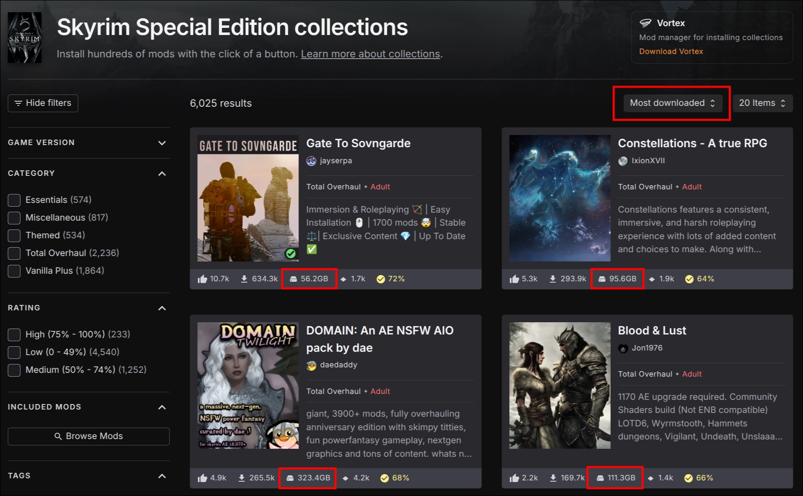

# Nx2.0 Archive Format

- **Status:** In Progress (Own Project)

!!! info "A next-generation archive format designed for high-performance mod distribution and asset loading"

    [GitHub Repository](https://github.com/Sewer56/sewer56-archives-nx) | [About Page](https://sewer56.dev/sewer56-archives-nx/) Around 50% done.

Nx2.0 is a modern, high-performance file format specifically designed for the unique needs of modding games.

It is the successor to the [Nx1.0 format](https://nexus-mods.github.io/NexusMods.Archives.Nx/), that I originally made in 2023 for the Nexus Mods App.

Nx2.0 expands on 1.0 by opening it up to a wider range of use cases; something I envisioned for the
format from the start but never got the opportunity to go through with the first time.

The format exploits strengths of modern storage hardware, while being flexible enough to be used in
a variety of scenarios, from mod distribution, to direct game engine integration.

!!! note "This document may be a bit more technical than the others."

## Why Nx2.0?

My goals with the Nx2.0 format encompass four primary use cases which I wish to achieve:

- [**File Downloads**](#1-file-downloads): Getting files to end users faster. Reducing storage and bandwidth costs for websites.
- [**Medium Term Archival**](#2-medium-term-archival): Backups with instant restore, like in the `Nexus Mods App`.
- [**Game Archive Format**](#3-as-a-game-archive-format): A replacement for legacy game archive formats, providing better performance and compression.
- [**Read Only FileSystem**:](#4-as-a-read-only-virtual-filesystem) Code that allows any modded game to directly load assets from Nx2.0 archives as if they were on disk.

### 1. File Downloads

!!! info "Nx2.0 is designed to supersede `.7z` as the de-facto best format for sharing mods."

!!! note "In the examples below I'll use the following dataset:"

    *The most downloaded mod for the most popular game on [nexusmods.com](https://nexusmods.com)*.

    Which is [Skyrim 202X by Pfuscher](https://www.nexusmods.com/skyrimspecialedition/mods/2347?tab=files) for Skyrim Special Edition.

The dataset consists of every single texture encoded with the BC1 format from from the mod's main downloads:

- [-Skyrim 202X 10.0.1 - Architecture PART 1](https://www.nexusmods.com/Core/Libs/Common/Widgets/DownloadPopUp?id=480708&game_id=1704)
- [-Skyrim 202X 10.0.1 - Landscape PART 2](https://www.nexusmods.com/Core/Libs/Common/Widgets/DownloadPopUp?id=480709&game_id=1704)
- [-Skyrim 202X 10.0.1 - Other PART 3](https://www.nexusmods.com/Core/Libs/Common/Widgets/DownloadPopUp?id=480715&game_id=1704)

File stats:

- ***File Count***: 334
- ***Size (Uncompressed):*** 4.668 GB

#### Using Bleeding Edge Compression Techniques, Transforms & Codecs

!!! info "The common archive formats like ZIP and RAR are old, antiquated compression techniques"

The legacy formats like ZIP, RAR, and 7z are based on compression algorithms that were designed in the 90s.

| Algorithm     | Size     | Ratio  |
| ------------- | -------- | ------ |
| Deflate (zip) | 3.10 GiB | 71.35% |
| RAR (4)       | 2.92 GiB | 67.13% |
| LZMA (7zip)   | 2.49 GiB | 57.19% |

For certain types of data like textures, we can use different compression techniques that achieve slightly
better results(1).
{ .annotate }

1. Compression algorithms based on Burrows-Wheeler Transform (BWT)/block sorting are particularly good at compressing textures. Which is why I'm using `bzip3` to show as an example.

| Algorithm   | Size     | Ratio  |
| ----------- | -------- | ------ |
| BZip3 (bz3) | 2.43 GiB | 55.90% |

Now, as a final blow, let's add the [dxt-lossless-transform](./dxt-lossless-transform.md) project of
mine to the mix, makes textures more compressible without loss in quality(1).
{ .annotate }

1. And improved performance!! You thought there was a catch here? Not today 😉

| Algorithm                            | Size     | Ratio  |
| ------------------------------------ | -------- | ------ |
| BZip3 (bz3) + dxt-lossless-transform | 2.27 GiB | 52.21% |

**The results speak for themselves:** while legacy formats top out at 2.49GiB with LZMA (7z), 
Nx2.0 with `dxt-lossless-transform` achieves 2.27GiB using bzip3.

The original mod author's `.rar` archive weighs in at a hefty 2.92GiB. ***Nx2.0 slashes this down by 650 MiB!!*** — that's 22.3% less!

**Real-world benefits:**

<ul>
<li><strong>22.3% reduction</strong> in Nexus CDN storage costs</li>
<li><strong>22.3% less bandwidth</strong> consumed per download</li>
<li><strong>> 22.3% faster downloads</strong> for every user(1)</li>
<li><strong>22.3% less disk space required</strong></li>
<li><strong>9% improvement</strong> even over the theoretical best-case legacy scenario (7zip/LZMA)</li>
</ul>

1. Remember, Nx2.0 can decompress archives as they are being downloaded, so users don't have to wait for the entire file to finish downloading. Therefore the improvement is greater than 22.3%.

#### Avoiding Duplicate files in Content Distribution Networks (CDNs)

!!! info "Today, mod sites like Nexus Mods store many duplicate versions of the same file, incuding additional costs."

Let's grab a few files from the same mod page:

- [`-Skyrim 202X 10.0 - Architecture PART 1`](https://www.nexusmods.com/Core/Libs/Common/Widgets/DownloadPopUp?id=480483&game_id=1704)
- [`-Skyrim 202X 9.0 - Architecture PART 1`](https://www.nexusmods.com/Core/Libs/Common/Widgets/DownloadPopUp?id=321878&game_id=1704)
- [`-Skyrim 202X 8.4.2 - Architecture PART 1`](https://www.nexusmods.com/Core/Libs/Common/Widgets/DownloadPopUp?id=209115&game_id=1704)

!!! note "Note: There are more versions/archives, I'm just limiting to 3 for simplicity"

Then let's have a peek inside...

- Duplicate files present in all 3 downloads: ***1108*** (65.2% out of all 1,698 files)
- Total size of these duplicate files: ***28.25 GiB*** (83.5% out of 33.8 GiB total)
- Potential space savings: ***17.84 GiB*** (after removing duplicates)

***Ergo, on the Nexus Mods CDNs we could be storing less than half*** (before compression) of the
data than what we're currently storing, *if we could remove the duplicates*.

But we (usually) can't.

!!! question "Why not?"

    The `.rar` and `.7z` formats in their default settings are what we call ***'SOLID'*** formats,
    meaning they smash all of the files together before compressing them.

    This means that it is not possible to extract a single file without extracting other parts of the
    archive. While that does improve compression ratios, it makes it impossible to
    separate files from each other.

Nx2.0 on the other hand can both be used as a SOLID archive format, and as a non-SOLID archive format.

*The preset for uploading Nx2.0 archives to the web is non-SOLID, so that files can be extracted individually.*

A sequential view of a Nx2.0 file in non-SOLID mode.

The data blocks only contain raw compressed data.  
This means that you can splice together archives.  

A user uploaded an updated version of a mod, adding `fence.dds`.

In this case, Block0 with `wood.dds` and Block2 with `model.obj` were in previously updated archives,
so we can reuse them from the previous upload.

!!! tip "In our Skyrim 202X example you would save the full 17.84 GiB!"

    That's less than half the storage we were previously using on our CDN!

#### Selective File Downloads

!!! info "Nx2.0 can be used to only download the files you need from an archive."

    Staying on the topic of chopping up archives, this is also worth mentioning.

Note how all of the archive info is stored in a single block at the beginning of the file.

When downloading Nx2.0 archives, you can download the header block first (typically <=4KB in size),
parse the information, and then decide which data blocks you want to download.(1)
{ .annotate }

1. This can be done using the `Range` HTTP header for example, which allows you to specify byte ranges to download.

This in turn means you can download only the files you need, without having to download the entire archive.

!!! question "Getting archive metadata in Nx2.0 archives is fast and efficient."

    In the 'web' preset, the Nx2.0 archive format uses around `~21.5 bytes per file` (after compression)
    to store the relevant filedata (file name, size, compression method, etc.).

    Given a MTU of 1450 bytes, that's approximately 67 files per packet. 
    Just 3 packets (200 files) are enough to get the metadata for ~95% of the mods out there(1).
    { .annotate }

    1. Based on my small-medium dataset of 221 Reloaded-II mods. That was every mod I had lying around on my machine when I was doing the research.

    This is where the `'typically <=4KB in size'` claim comes from.

##### Selective File Downloads in Practice

!!! success "Here's an example where Nx2.0 transforms your modding experience"

**The scenario every modder knows too well:**

You have:

- [`-Skyrim 202X 8.4.2 - Architecture PART 1`](https://www.nexusmods.com/Core/Libs/Common/Widgets/DownloadPopUp?id=209115&game_id=1704)

And you want to update to the shiny new version:

- [`-Skyrim 202X 10.0 - Architecture PART 1`](https://www.nexusmods.com/Core/Libs/Common/Widgets/DownloadPopUp?id=480483&game_id=1704)

You're ***jumping across multiple versions***, so there's no direct update path from the mod author.(1)
{ .annotate }

1. Well... — ***update paths are pretty rare anyway***... It's usually always "download the whole thing again." But this makes for a perfect real-world example of the pain we all experience.

**The old way:** Queue up another `8.2GB` download. Go grab coffee, maybe lunch. Hope your internet doesn't hiccup.

**The Nx2.0 way:** Here's the game-changer — ***(51.8% !!) of that massive download consists of files you already have on your hard drive*** from the previous version. 

*Why download what you already own?*

With Nx2.0, ***you skip the redundant files entirely and download only the 48.2% that's actually new***.(1) That's not just faster — that's ***game changing***.
{ .annotate }

1. And here's the kicker: those files are ***already smaller with Nx2.0's superior compression***, so you're downloading even less than 48.2% compared to today's status quo!

------

**The bottom line:** 

- The user gets their mod update more than twice as fast. 
- Mod authors don't need to manually make update paths.
- Nexus Mods ***spends less than half the bandwidth costs***.

*It's a win-win for everyone.*

#### File Deduplication

!!! info "Nx2.0 is capable of deduplicating files within the same archives."

    This in fact is a feature of Nx1.0 already, [here's the relevant changelog](https://github.com/Nexus-Mods/NexusMods.Archives.Nx/releases/tag/0.6.4).

Sometimes game developers duplicate files in their games.

Common examples include:

- ***To reduce load times***, by placing related files closer together on disc 💿.
    - For example, all files relating to a stage in a single folder.
- ***Providing higher quality assets***.
    - ***Higher quality*** for single player modes or menus where less models are shown.
    - ***Lower quality*** in-game where there's multiple.

When making mods, for example, replacing a car in a racing game, mod authors will have to replace
all copies of these files. 

Usually mod authors will make just one file, and then copy it to all the other locations, meaning
that the same file will be stored multiple times in the archive.

<figure markdown="span" class="annotate">
  
  <figcaption>'FlatOut 2', a game I've always loved is one such example of this. So let's try deduplication on extracted files of a full game mod.(1)</figcaption>
</figure>

1. Not just a car pack, the name is a bit misleading.

Demonstrated with Nx1.0

| Method                   | Size    |
| ------------------------ | ------- |
| Nx1.0 No Deduplication   | 3.0 GiB |
| Nx1.0 With Deduplication | 2.1 GiB |

In this case, the items being deduplicated are menu and in-game car models and textures.

!!! note "SOLID archive formats like `.7z` and `.rar` can also deduplicate files."

    However, *they do so at the cost of being able to extract individual files from the archive*.

    In addition, their deduplication is not as efficient as Nx2.0's. 
    
    Nx2.0 supports deduplication ***natively***; however `.7z` and `.rar` rely on the compression algorithm
    to find the same data previously in the smashed together (SOLID) data.
    
    If the archive is large, the compressor may fail to find the same data previously compressed,
    leading to larger archive sizes in those archive formats.

    See: ['Why 7z archives created by new version of 7-Zip can be larger than archives created by old version of 7-Zip?'](https://www.7-zip.org/faq.html)

    -----

    Extra note: Extracting duplicated files in `Nx2.0` is a memory copy, so it's super fast!!
    That's ***24GB/s (single threaded)*** on Ryzen 7000/9000 CPU.

#### Delta Updates

!!! info "Nx2.0 can be used for binary patching of files."

    Sometimes the game does not load loose files, sometimes most of the mod contents are packed into a 
    single archive, like, for example a `.pak` file for Unreal Engine games.

Nx2.0 supports binary patching of files natively; meaning that you can create a patch archive
that will turn one inner file into another inner file.

Planned implementation details are in the [Reloaded3 Specification](https://reloaded-project.github.io/Reloaded-III/Server/Packaging/File-Format/Archive-User-Data-Format.html#header-delta-update); also [Delta Patching Logic](https://reloaded-project.github.io/Reloaded-III/Server/Packaging/File-Format/Delta-Patching-Logic.html). 
These will be moved to the Nx2.0 documentation soon, and become a built-in feature of Nx2.0.

<figure markdown="span" class="annotate">
  
  <figcaption>My Reloaded-II Framework supports delta patches. Same mod as before in the example above.</figcaption>
</figure>

We did a binary patch over a ~2GB game's native `.bfs` archive.  
(i.e. `selo_1.5.0.bfs` (2GB) -> `selo_1.5.1.bfs` (2GB)).

Now the upgrade path from 1.5.0 to 1.5.1 is just a 138MB patch, rather than a 1300+MB full download.

#### Improved Authoring Experience for Mod Authors

!!! warning "Managing large-scale mods can be a frustrating experience for mod authors"

Let's again use the most popular mod for the most popular game on Nexus.

We'll combine the full:  

- [-Skyrim 202X 10.0.1 - Architecture PART 1](https://www.nexusmods.com/Core/Libs/Common/Widgets/DownloadPopUp?id=480708&game_id=1704)
- [-Skyrim 202X 10.0.1 - Landscape PART 2](https://www.nexusmods.com/Core/Libs/Common/Widgets/DownloadPopUp?id=480709&game_id=1704)
- [-Skyrim 202X 10.0.1 - Other PART 3](https://www.nexusmods.com/Core/Libs/Common/Widgets/DownloadPopUp?id=480715&game_id=1704)

archives into a single one to demonstrate the scale of the problem.

**Combined Archive Stats:**

- ***File Count***: 2,087
- ***Size (Uncompressed):*** 31.7 GiB

##### What Things Are Like Today

!!! note "The current reality for mod authors is far from ideal."

Let's get right into it, with results first.

Here's how things look like on my home computer, creating a `.7z` archive, and uploading it to the web.

| Format    | CPU     | Compressed Size | Compression Time | Upload Time @ 100Mbit/s | Total Time    |
| --------- | ------- | --------------- | ---------------- | ----------------------- | ------------- |
| LZMA (7z) | 9950X3D | 20.1GiB         | 12 min 1.29s     | 28 min 46.58s           | 40 min 48.87s |

***However everyone has the luxury of the world's fastest consumer CPU and high upload speeds.***
So let's add some recent hardware that our users are much more likely to have, with an average
fixed landline internet connection.

| Format    | CPU     | Compression Time Estimate | Upload Time @ 40Mbit/s | Total Time    | Notes                             |
| --------- | ------- | ------------------------- | ---------------------- | ------------- | --------------------------------- |
| LZMA (7z) | 7800X3D | ~ 22 min                  | 1h 11 min 56s          | ~1h 34min     | Most popular high end gaming CPU. |
| LZMA (7z) | 7600X   | ~ 27 min 18s              | 1h 11 min 56s          | ~1h 39min 14s | Most popular CPU used by gamers.  |

*Almost 2 hours... quite rough, isn't it?*

??? note "Compression time is estimated based on results of built-in 7zip benchmark utility."

    Scaled using [7-Zip Compression Benchmark Results](https://gamersnexus.net/cpus/amd-ryzen-9-9950x3d-cpu-review-benchmarks-vs-9800x3d-285k-9950x-more#9950x3d-production-benchmarks); which scales accurately with compression time in practice.

***Compressing for web takes a very long time***. Large projects take long to compress, *and especially long* to upload.

***Some mod authors split up their mods to avoid waiting***: Notice how the mod above has '3 parts'?
Rather than endure long wait times, you will often see author break their mods into multiple archives. 
This is inconvenient, for both authors and users, but it's the only way they can use to make things manageable.

***Mod authors have to manually make upgrade paths, and many don't***: Creating upgrade paths between versions requires manual time consuming work.
Most mod authors don't want to do that, ***especially after spending 2 hours making a release***. 

As a result, mod authors experience pain, and end users have to download entire archives again for each update.

##### Uploading a Mod for the First Time in Nx2.0

!!! question "How would Nx2.0 make the upload experience better?"

We'll start with the 'baseline' improvement, what is the experience with Nx2.0 compared to `.7z`?(1)
{ .annotate }

1. `.7z` is the current best legacy option

Nx2.0 offers marginal improvements across the whole spectrum:

- ***Compression is much faster***; reducing waiting times to have an archive ready for upload.
- ***Archives are smaller***; meaning that users need to upload less data.

Let's do a quick estimation 

**Compression Performance:**

| Format                           | CPU     | Compression Time | Improvement (Ratio) | Compressed Size | Improvement (Ratio) |
| -------------------------------- | ------- | ---------------- | ------------------- | --------------- | ------------------- |
| BZip3                            | 9950X3D | 6min 7.42s       | 5 min 53.87s (0.51) | 19.62GiB        | 0.976               |
| BZip3 + [dxt-lossless-transform] | 9950X3D | ~6min 9s         | ~ 5 min 50s (0.51)  | 17.66GiB        | 0.879               |

**Upload Performance:**

| Format                           | Upload Time @ 100Mbit/s | Improvement (Ratio) |
| -------------------------------- | ----------------------- | ------------------- |
| BZip3                            | 28 min 5.3s             | 41.23s (0.976)      |
| BZip3 + [dxt-lossless-transform] | 25 min 17.0s            | 3m 30s (0.879)      |

**Combined:**

| Format                           | Total Time   | Improvement (Ratio) |
| -------------------------------- | ------------ | ------------------- |
| BZip3                            | 34 min 12.8s | 6 min 36s (0.838)   |
| BZip3 + [dxt-lossless-transform] | 31 min 39s   | 9 min 9s (0.775)    |

Hey, ***that's almost 25% faster!***

??? note "Result with `dxt-lossless-transform` is projected (expand for more info)."

    Expected result, with ~2% margin of error on improvement in file size.

    This is the result that's expected based on both the results of the existing BC1 implementation and the prior prior prototypes done on the `dxt-lossless-transform` project. Currently only BC1 is finalized. Prototype versions of BC2 and BC3 texture formats show similar improvements. I however don't know much BC7 will improve, it's too early to tell.

And now let's scale those results to hardware and internet speeds that our users are more likely to have.

**Performance on More Common Hardware @ 40Mbit/s Upload:**

| Format            | CPU     | Compression Time | Upload Time @ 40Mbit/s | Total Time       | Improvement (Ratio)  |
| ----------------- | ------- | ---------------- | ---------------------- | ---------------- | -------------------- |
| BZip3             | 7800X3D | ~9min 59.26s     | 1h 10min 13.36s        | ~1h 20min 12.62s | 13min 47.38s (0.853) |
| BZip3             | 7600X   | ~13min 54.04s    | 1h 10min 13.36s        | ~1h 24min 7.4s   | 15min 6.6s (0.847)   |
| BZip3 + transform | 7800X3D | ~10min 1.84s     | 1h 3min 12.46s         | ~1h 13min 14.30s | 20min 45.7s (0.779)  |
| BZip3 + transform | 7600X   | ~13min 57.63s    | 1h 3min 12.46s         | ~1h 17min 10.09s | 22min 3.91s (0.777)  |

For large mods full of textures, the user will be able to complete the `archive` -> `upload` process
***22.3% faster*** (using 0.777x of the time) than with the current `.7z` format. 

For the `.zip` and `.rar` formats, the improvement is expected to be around 30%.

***This is the 'baseline', the magic of Nx2.0 comes right ahead.***

!!! note "Note: For non-texture data, the improvement here is negligible."

    I've focused on textures here as ***that's where all the large archives are***. In a typical mod setup,
    you'll have a bunch of large texture mods, and many small non-texture mods. Textures
    usually represent ~90% of disk space in a mod setup.

    Non-texture mods are typically <100MiB in size, so the compress and upload times are not a problem
    in user experience (~20 seconds total). This is why I've focused on where it's specifically painful
    for mod authors.

    For non-texture data, the optimal codec is usually LZMA, so the 'worst case' scenario for Nx2.0 with any data 
    being equal with `7z` (the best case legacy scenario). 

##### Making Mod Updates Faster with Nx2.0

!!! info "What do you do is you want to update your mod?"

    Nx2.0 has a nice built-in feature that allows you to construct new archives using previous
    archives as a base.

This feature already exists (mostly) in Nx1.0, [(relevant changelog)](https://github.com/Nexus-Mods/NexusMods.Archives.Nx/releases/tag/0.6.4)
and powers the 'Garbage Collector' feature of the Nexus Mods App.

Suppose you're a mod author, and you're about to release a new version of your mod, like `10.0`.

- [-Skyrim 202X 10.0](https://www.nexusmods.com/Core/Libs/Common/Widgets/DownloadPopUp?id=480483&game_id=1704)

You can use the `.nx` archive for any previous version of the mod, such as:

- [-Skyrim 202X 9.0](https://www.nexusmods.com/Core/Libs/Common/Widgets/DownloadPopUp?id=321878&game_id=1704)

To accelerate the process of creating the archive for `10.0`.

*In this case, around 45% of the needed data is already present in the `9.0` archive.*

I'll use the existing Nx1.0 archive format to demonstrate:

| Format                                 | CPU     | Packing Time (ZStandard -22) | Notes                                         |
| -------------------------------------- | ------- | ---------------------------- | --------------------------------------------- |
| Nx1.0                                  | 9950X3D | 5min 4s                      | World's fastest consumer CPU.                 |
| Nx1.0 w/ `9.0` Archive as 'reference'. | 9950X3D | 2min 54.2s                   | [on my actual hardware, with 5.0 drive]       |
| Nx1.0                                  | 7800X3D | 8min 16s                     | ***[Estimate]*** Popular high end Gaming CPU. |
| Nx1.0 w/ `9.0` Archive as 'reference'. | 7800X3D | 4min 42s                     | (assuming NVMe Gen 4.0 drive)                 |
| Nx1.0                                  | 7600X   | 11min 30s                    | ***[Estimate]*** Typical mid range CPU.       |
| Nx1.0 w/ `9.0` Archive as 'reference'. | 7600X   | 6min 29s                     | (assuming NVMe Gen 4.0 drive)                 |

Because we were able to directly copy 45% of the data without compressing again, archive creation time was slashed.

***A minor/patch update like `10.0.0` -> `10.0.1` (only changes 200MB) would only take ~10 seconds***
on the other hand, rather than 5-12 minutes.

!!! note "An extra bonus"

    And lastly, as per [Selective File Downloads](#selective-file-downloads), mod authors don't have to make
    upgrade paths for the simple case manually anymore. So that's a bonus.

##### Uploading Mod Updates

!!! tip "It should be possible to upload only the unique data from Nx2.0 archives to `nexusmods.com`."

    A superpower, that could be made possible if we also got some support from the web team at Nexus.

Remember how we can [splice Nx2.0 archives?](#avoiding-duplicate-files-in-content-distribution-networks-cdns), and then
in turn only download what we need?

***That could also be applied to uploads.***
Since the CDN would store 'blocks' of data, rather than full archives, it would be possible to
upload only the new blocks of data, rather than the entire archive.

**Upload Time Comparison:**

Suppose you previously uploaded `9.0` and now are uploading `10.0`, the upload time is reduced to `0.55`,
because 45% the data was already uploaded in version `9.0`.

| Version             | Archive Size | New Data (Ratio) | Upload Time @ 40Mbit/s | Notes                                                         |
| ------------------- | ------------ | ---------------- | ---------------------- | ------------------------------------------------------------- |
| **9.0 (Previous)**  | 15.99 GiB    | 15.99 GiB        | 57min 14s              | First time upload. Nx2.0 w/ dxt-lossless-transform (expected) |
| **10.0 (Overhaul)** | 17.66 GiB    | 9.67 GiB (0.55)  | ~34min 36s             | 45% data reused from 9.0                                      |
| **10.0.1 (Hotfix)** | 17.66 GiB    | 200 MiB (0.0097) | 41.9s                  | Only 200MiB new data to upload                                |

Compare with the current status quo:

| Version             | Archive Size | New Data | Upload Time @ 40Mbit/s | Notes                          |
| ------------------- | ------------ | -------- | ---------------------- | ------------------------------ |
| **9.0 (Previous)**  | 18.2 GiB     | 18.2 GiB | 1h 5 min 8s            | First time upload              |
| **10.0 (Overhaul)** | 20.1 GiB     | 20.1 GiB | 1h 11 min 56s          | 45% data reused from 9.0       |
| **10.0.1 (Hotfix)** | 20.1 GiB     | 20.1 MiB | 1h 11 min 56s          | Only 200MiB new data to upload |

*Upload times are dramatically reduced when most data is already present in previous versions.*

Getting a hotfix out in ***1 minute***, rather than ***1h 30m*** is a game changer for mod authors.
At least in my opinion.

### 2. **Medium Term Archival** 

!!! info "For storing backups that need to be instantly restored, at will."

    You need a backup of some data, which then you need to restored later.
    That restore operation needs to be as fast as humanly possible.
    You need to extract 10s of gigabytes of mods in seconds, not minutes.

    This is how the `Nexus Mods App` uses the original Nx1.0.

For this specific use case we use `ZStandard` compression, rather than the more expensive (slow)
algorithms like `bzip3` or `LZMA`, which are more suitable for web distribution which put more
priority on size.

This allows us to achieve the best possible tradeoff between speed and compression ratio
that matches the needs of modern NVMe drives.

#### Existing Nx1.0 Results

!!! note "Test Setup"

    Dataset: All textures from Skyrim SE's 11 Most Popular Texture Mods.(1)
    { .annotate }

    1. Most Downloaded Mods on Nexus' Most Popular Game, Skyrim Special Edition.

    System Specs:

    - AMD Ryzen 9 9950X3D (32) @ 5.76 GHz
    - AMD Radeon Graphics [Integrated]
    - 96 GB DDR5 RAM @ 6000 MT/s, CL30, 1:1 Mode Infinity Fabric
    - Samsung 9100 Pro W/Heatsink 4 TB M.2-2280 PCIe 5.0 X4 NVME SSD
        - World's Fastest SSD, at time of benchmarking

    Compression Settings:

    - Compression: `zstandard` level 16
    - Block Size: 16MiB

Consider the benchmarks for Nx1.0 Archive Format I originally made for the App as a 'preview':

| Threads (9950X3D) | Speed (GiB/s)          | Notes                                         |
| ----------------- | ---------------------- | --------------------------------------------- |
| 1                 | 2.07                   |                                               |
| 2                 | 3.99                   |                                               |
| -                 | 2.35/4.37 (Read/Write) | World's fastest PCI-E Gen 4.0 NVMe            |
| 4                 | 6.96                   |                                               |
| -                 | 4.69/8.53 (Read/Write) | World's fastest PCI-E Gen 5.0 NVMe            |
| 6                 | 8.69                   | ~[5700X, 12600K]                              |
| 8                 | 9.93                   | ~[9800X3D, 7800X3D, 7700X, 9700X],            |
| -                 | 11.49                  | ~[Zen3 w/ `>8 cores`: 5900X, 5950X], [12600K] |
| -                 | 12.45                  | ~[13600K]                                     |
| 12                | 13.74                  | ⚠️ DDR5 Ryzen Memory Bottlenecks here          |
| 24                | 14.13                  |                                               |

These are benchmarks for extracting files from an archive.

We're using the same drive for reading and writing, as most users would, so the hardware resources (PCI-E lanes)
are shared for reading and writing.

The listed numbers are optimal for each drive type assuming a `0.7093` compression ratio.

??? note "Explanation of NVMe SSD Numbers Above (For Number Lovers) [Expand Me]"

    Resources are shared between read and write operations, due to limitations of PCI-E Bandwidth,
    so the optimal read and write ratios are calculated as follows:

    - Optimal Read Ratio calculated as `(0.7093 / 2)` == `0.35465`
    - Optimal Write Ratio calculated as `(1s − (0.7093 / 2))` == `0.64535`

    You multiply the advertised speed of the SSD by these ratios to get the optimal read and write speeds.
    e.g. `7100MB/s * 0.35465s == 2.35GiB/s` read speed, and `7100MB/s * 0.64535 == 4.37GiB/s` write speed.

#### Nx2.0 Improvements

!!! info "Nx2.0 can leverage [dxt-lossless-transform](./dxt-lossless-transform.md) to improve size and performance even further."

    As we can see above, when extracting files, the NVMe drives become a bottleneck.
    With `dxt-lossless-transform`, the files become smaller, meaning we need to read less data from the drive.

The Nexus Mods App uses ZStandard Level 9 for real-time recompression on mod downloads. 

The improvement in compression ratio with `dxt-lossless-transform` is 15.1% compared to Nx1.0.

This makes the new compression ratio `0.602`(1).
{ .annotate }

1. Derived as `0.7093 × 0.849` == `0.602`.

| Write Speed (GiB/s) | Notes                                                 |
| ------------------- | ----------------------------------------------------- |
| 4.37                | [Old] World's fastest PCI-E Gen 4.0 NVMe drives       |
| ***4.62***          | ***[New]*** World's fastest PCI-E Gen 4.0 NVMe drives |
| 8.53                | [Old] World's fastest PCI-E Gen 5.0 NVMe drives       |
| ***9.24***          | ***[New]*** World's fastest PCI-E Gen 5.0 NVMe drives |

By having to read less from disk, *we can now use those remaining resources to write more, getting faster 'Apply'/'Extract' operations*.

<figure markdown="span">
  
  <figcaption>And this would be very handy when deploying 100GB+ collections.</figcaption>
</figure>

And of course 😉, ***most importantly***, as the files are now smaller, users would now only need
~85-87GB of disk space to download a collection where we may have previously used ~100GB.

*That's quite valuable!*

### 3. **As a game archive format**

!!! tip "Nx2.0 can be directly integrated into game engines as a native archive format."

    This is the another use case I want to achieve with Nx2.0.

!!! info "This is a personal goal of mine, not an 'MVP' sort of thing."

    But rest assured, Nx2.0 will be better than most AAA game archive formats for the job(1).
    { .annotate }
    
    1. I speak from experience, having reverse engineered many of them. 
    
    That's a promise. 😉

Via code injection, we could add support for Nx2.0 archives to existing game engines,
allowing them to read assets directly from the archive.

#### Fast Load Times

!!! info "Nx2.0 has a game-specific profile, which optimizes for load times."

    It's very similar to the Nx1.0 profile for [Medium Term Archival](#2-medium-term-archival)
    used in the App, but we don't need to recompress files as they're downloaded on the fly,
    so we can spend a bit longer compressing.

I'll reuse the Nx1.0 reference benchmarks from before, but with new targets for NVMe drives.(1)
{ .annotate }

1. This time we can use the full PCI-E bandwidth for reading data as we're not writing, so our calculations become simple. We just divide advertised speeds by the compression ratio (`0.7093`).

| Threads (9950X3D) | Speed (GiB/s) | Notes                                                |
| ----------------- | ------------- | ---------------------------------------------------- |
| 1                 | 2.07          |                                                      |
| 2                 | 3.99          |                                                      |
| 4                 | 6.96          |                                                      |
| 6                 | 8.69          | ~[5700X, 12600K]                                     |
| -                 | 9.27          | Max read speed of world's fastest PCI-E Gen 4.0 SSDs |
| 8                 | 9.93          | ~[9800X3D, 7800X3D, 7700X, 9700X]                    |
| -                 | 11.49         | ~[Zen3 w/ `>8 cores`: 5900X, 5950X], [12600K]        |
| -                 | 12.45         | ~[13600K]                                            |
| 12                | 13.74         | ⚠️ DDR5 Ryzen Memory Bottlenecks here                 |
| 24                | 14.13         |                                                      |
| -                 | 16.89         | Current PCI-E Gen 5.0 SSDs                           |
| -                 | 19.55         | Practical limit of PCI-E Gen 5.0 SSDs                |

!!! note "High-End Consumer Gen 5.0 SSDs are still very recent"

    As in '1 year old' recent. Very few people have them, as they're still fairly expensive and
    generally not recommended by reviewers given that practical improvements are negligible.

In that regard, all existing >=98% of users can take 100% advantage of their NVMe Gen <= 4.0 SSDs.

#### Expected Nx2.0 Performance

!!! tip "Don't forget [dxt-lossless-transform](./dxt-lossless-transform.md#unpack-performance)"

    You may notice that in the table above, the drive is the bottleneck for Gen 4.0 SSDs,
    not RAM or CPU.

`dxt-lossless-transform` improves the compression ratio by 13-15% on average, which in turn means
we have to read less data from the drive to get the same amount of data decompressed in RAM.

Combined with the 15% improvement in general [load times](./dxt-lossless-transform.md#unpack-performance),
we can go beyond the previous limits.

!!! question "What does that enable?"

#### Nx2.0 is Competitive with DirectStorage

!!! tip "Nx2.0 will produce load times competitive with DirectStorage."

    Faster for NVMe Gen 4.0 SSDs, a bit slower for Gen 5.0 SSDs.  
    That may sound like a bold claim, but hear me out.

There is a fairly common misconception that in DirectStorage data flows directly from the NVMe drive to the GPU,
bypassing the CPU and RAM. [On Windows, that is false](https://github.com/microsoft/DirectStorage/blob/main/Docs/DeveloperGuidance.md#compressed-data-flow).

Let's compare the loading of texture assets on a Gen 4.0 NVMe SSD with DirectStorage and Nx2.0:

Loading with DirectStorage 👆

Loading with Nx2.0 👆

By all means, you would imagine that DirectStorage is faster, right?  
***Well, not quite.*** Here's the gotcha!

All files are passed through all of the operations as shown above, one by one, like on a conveyor belt.

Which exposes a very clear bottleneck, *the NVMe SSD!*

!!! tip "*DirectStorage is bottlenecked by the NVMe Read Speed!*"

and... ***in Nx2.0, the textures are smaller than in DirectStorage***!

In other words, to decompress the same amount of data, *DirectStorage needs to read much more data from the SSD than Nx2.0 does*.
And, because, for Gen4.0 drives, [even upper mid range CPUs can decompress fast enough to keep up](#fast-load-times), Nx2.0
will achieve better load times than DirectStorage.

!!! question "Why are textures smaller in Nx2.0?"

    In order to achieve fast decompression, *DirectStorage* splits data into very small chunks, which are then
    decompressed in parallel by the GPU; which hurts compression ratio. DirectStorage also uses `GDeflate`,
    which is less efficient than the `ZStandard` codec used in Nx2.0.

!!! tip "That doesn't mean you shouldn't use DirectStorage."

    I just thought it was an interesting comparison.

    If you have a use case where you need to dynamically stream in compressed textures
    (e.g. load new terrain in an open world game), then DirectStorage is the way to go 
    as it relieves CPU load.

### 4. **As a Read Only Virtual FileSystem** 

!!! info "Something suitable in a [reloaded redirector] / [usvfs] style project."

    In many mods we're unnecessarily losing out on Disk Space and Load Times. 
    I want to do better.

!!! note "Note: My plans are to build this as part of my [Reloaded3] modding framework project."

    It would use Reloaded3's own mod loader and be loaded like any other standard mod as part of a unified ecosystem.
    Therefore, you might not see it till 2028, or similar.

    Could make standalone if there's demand for it at that point, it's just that I want to start
    with a strong base/foundation.

    *Below are examples of existing cases in the modding ecosystem of why technology like this is needed.*

#### Nexus Mods App: Improving Disk Space

!!! info "In the Nexus Mods App, we store 2 copies of every file that is applied (active)"

    And with this sort of technology, we could avoid that.

When we download mods in the App, each mod goes through the following steps:

How it looks like, on a typical mid range machine.

We first download an archive, then we extract all the files, and lastly we re-compress them into the
Nx1.0 format.

The problem arises, when we 'Apply' the mods after they're enabled.

This is a straight extract operation.
Meaning we now have 2 copies of every file in the game directory, a compressed copy in the Nx1.0 archive,
and an uncompressed copy in the game directory.

<figure markdown="span">
  
  <figcaption>This image (again) of most popular collections is a good indicator why it's a problem.</figcaption>
</figure>

Suppose the user installs `DOMAIN: An AE NSFW AIO` (323.4GB) download from Nexus Mods, and then applies
it to their game. Our disk usage is going to be quite nasty:

- `~350GB` for the compressed collection files.
- `~500GB` for the uncompressed collection files in the game directory.

That's... more than double of the collection size. Almost 1TB of disk space used for a single collection,
that's very much not good.

#### Reloaded-II: Improving Load Times

!!! info "Mods in my Reloaded-II Framework rely on Virtual FileSystem (VFS) to load assets."

    Mods for various games in Reloaded-II are loaded by hooking (injecting custom code) either into
    Windows APIs or the game engine's file loading functions.

I'll keep this short.
A lot of Reloaded-II mods live as loose files in the `Reloaded-II/Mods/{ModName}` folder.

That was some caveats:

- We could be saving disk space by compressing the files.
- We could be improving load times, as loading data from Nx is faster than uncompressed.
- Loading many small files (on Windows) is painfully slow.

That's about it. Refer to benchmarks above.

#### The Ideal Solution

!!! tip "Load the compressed data directly into the games, without extraction."

    And that's what it's all about.

Normally you get something like this:

We want to do this:

The VFS sits in the middle and does some magic 😇.

!!! note "Performance is Key Here"

    Nx2.0 is designed to be suitable for read-only virtual file systems, where seeking and unusual
    file access patterns may occur.

This is done with an adjustable 'block size'. Nx2.0 allows you to split files into smaller,
more compressible blocks, which can be loaded independently. If you need to seek, you find the block
containing the data you need, and then you decompress that block if it is not already decompressed.

This is the same as how ZStandard compression works in filesystems like `btrfs`.

!!! note "Another personal goal of mine."

    `'NxVFS'` is a planned component of my [Reloaded3] modding framework project.

    You can find the technical details in the [Virtual FileSystem](https://reloaded-project.github.io/Reloaded-III/Mods/Essentials/Virtual-FileSystem/About.html) and [File Emulation Framework](https://reloaded-project.github.io/Reloaded-III/Mods/Essentials/File-Emulation-Framework/About.html) sections.

## Roadmap

!!! info "Please See [dxt-lossless-transform](./dxt-lossless-transform.md#deployment-and-rollout) roadmap."

    As usual, if the reader thinks this would be beneficial for Nexus Mods, please offer me some patronage
    by allotting me extra time to work on this.

I was going to make this page longer, than I noticed, it's already way too long, so let's stop here.

[reloaded redirector]: https://reloaded-project.github.io/reloaded.universal.redirector/
[usvfs]: https://github.com/ModOrganizer2/usvfs
[Reloaded3]: https://reloaded-project.github.io/Reloaded-III/
[dxt-lossless-transform]: ./dxt-lossless-transform.md