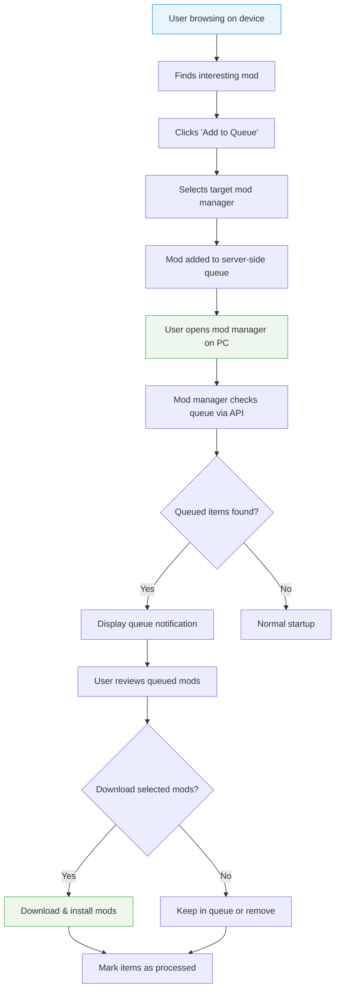

# Download Queue for Cross-Device Modding

!!! info "Complementary Feature to NXM Handler"
    
    This feature builds upon the [Send Downloads to Specific Mod Manager](./nxm-handler.md) concept to enable cross-device mod queuing.

- **Status:** Unknown

## The Problem: Mobile Browsing, Desktop Modding

!!! warning "Current workflow is broken for mobile users"

Many users browse Nexus Mods on their mobile devices while away from their gaming PC, but there's currently no way to "bookmark" or queue mods for later download when they return to their desktop.

**Current mobile experience:**

1. User finds interesting mods while browsing on phone/tablet
2. User has to remember mod names or bookmark web pages
3. Later, user manually searches for each mod again on desktop
4. User repeats the "find and download" process

This creates unnecessary friction and often leads to users forgetting about mods they wanted to try.

## What I Want

### Core Concept: Per-Mod-Manager Download Queues

A server-side queue system that allows users to:

1. **Queue downloads from any device** (mobile, desktop, different computers)
2. **Target specific mod managers** - send an item to a mod manager specific queue

Then, with a compatible mod manager users could:

1. **Review queued items** before downloading when opening the mod manager

The feature should work regardless of the device used for browsing.
Queuing a mod from your friend's PC to your own PC is equally as valid as queueing a mod from
your phone (on a bus) to your desktop.

### User Experience Flow



## Technical Implementation

### 1. Minimal Required API

!!! info "An *example of a simple API* needed on mod manager side"

    Nothing more, nothing less.

```rust
pub trait ModQueue {
    /// Get all queued items for a specific mod manager
    async fn get_queue(&self, mod_manager_id: &str) -> Result<Vec<QueuedItem>, QueueError>;
    
    /// Remove a specific item from the queue
    async fn remove_from_queue(
        &self,
        mod_manager_id: &str,
        queue_item_id: &str
    ) -> Result<(), QueueError>;
    
    /// Clear all items from a mod manager's queue
    async fn clear_queue(&self, mod_manager_id: &str) -> Result<(), QueueError>;
}

/// A queued item with metadata
#[derive(Debug, Clone)]
pub struct QueuedItem {
    pub game_id: u32,
    pub mod_id: u32,
    pub file_id: u32,
    pub queued_at: SystemTime,
}

/// Server-side error types for queue operations
#[derive(Debug)]
pub enum QueueError {
    // Authentication and authorization errors
    Unauthenticated,        // User not logged in or invalid session
    Unauthorized,           // User lacks permission for this operation
    TokenExpired,           // Authentication token has expired
    
    // Mod manager and queue errors
    ModManagerNotFound,     // Specified mod manager ID doesn't exist
    QueueItemNotFound,      // Requested queue item doesn't exist
    
    // Server and internal errors
    InternalError(String),  // Generic server-side error with details
}
```

### 2. Website Integration

#### Queue Button UI

On each mod page, add an "Add to Queue" button that:

1. Shows a dropdown of registered mod managers
2. Allows selecting which mod manager should receive the queued download
3. Provides visual feedback when items are successfully queued

Think 'mod manager download' button.
Can attach to existing button, or be a separate button.

#### Queue Management Page

A dedicated page where users can:

- View all queued items across all mod managers
- Remove items from queues
- See which mod manager each item is queued for

Basically the Mod Manager API, but on a web page. A way to viewed queued items.

### 3. Security Considerations

I'll leave it to web team to figure out the best way for programs not to touch other programs' queues.