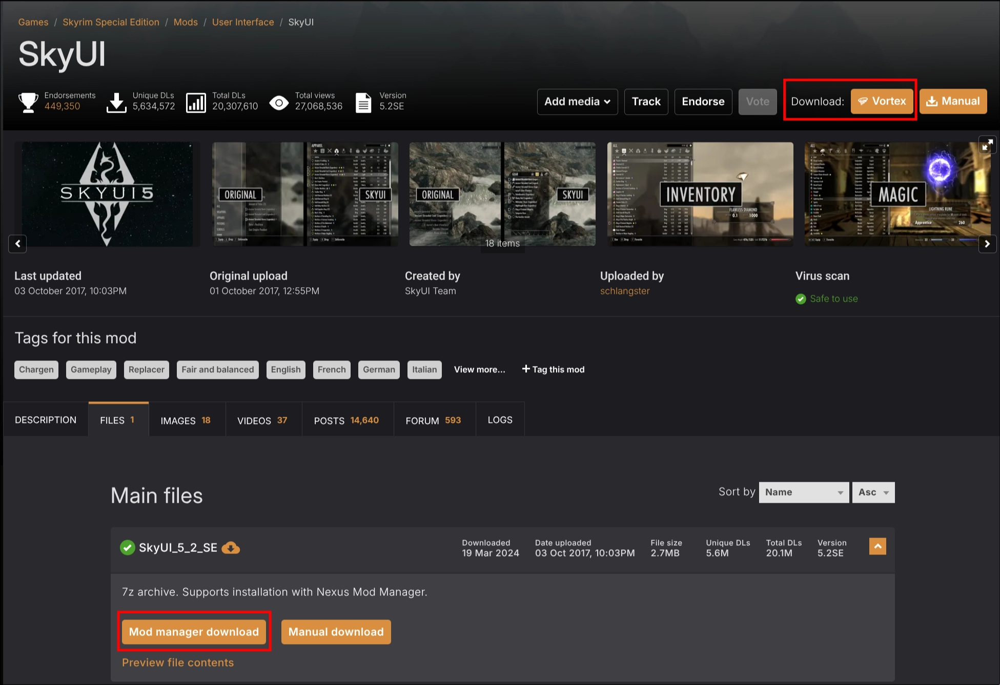
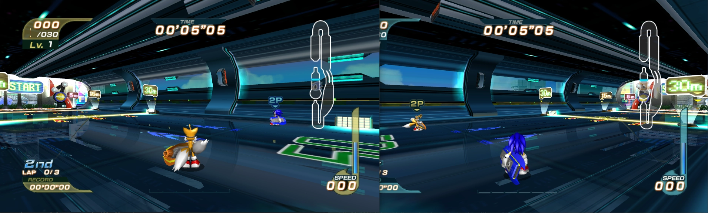
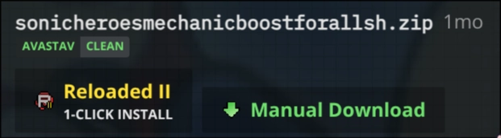
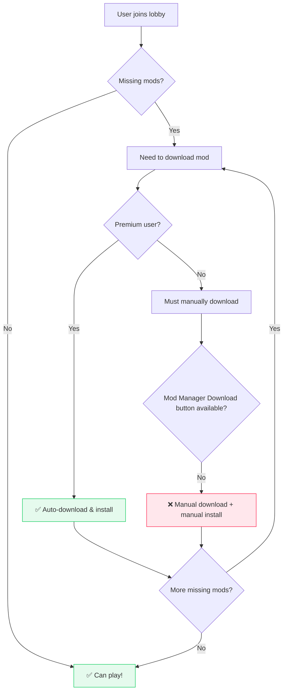

# Send Downloads to Specific Mod Manager

!!! info "Current System Overview"
    
    Nexus Mods provides a 'Mod Manager Download' button that automatically sends downloads to your mod manager using `nxm://` protocol links.

- **Status:** Unknown/Shortlisted 

<figure markdown="span">
  
  <figcaption>'Mod Manager' download button, as seen today.</figcaption>
</figure>

Pressing this button opens a URL that starts with `nxm://`; and it is sent to the last application
on the user's computer that said `'I can handle nxm://'`.

## How It Works Today

When you click the "Mod Manager Download" button, it creates a special URL starting with `nxm://`. Your operating system then sends this link to whichever mod manager was the last one to register as being able to handle these links.

## Current Problems

### Problem 1: Vortex-Only Policy

!!! warning "Download button is ONLY allowed for games supported by Vortex"

    The current site policy is to only allow 'Mod Manager' download
    button to be shown if a game is supported by Vortex Mod Manager.(1)
    { .annotate }

    1. A few (<10) legacy games from before this policy are exceptions.

This is stated to be in order to 'avoid confusion', but it goes against our core ethos of
*making modding easy*.

Without a *'mod manager download'* button, users would have to explicitly read
the *mod description* in order to learn how to install a mod.

In a world where attention spans are short this is difficult. People expect things to *'just work'*.
With people ***new to modding*** this creates a barrier to entry. Especially affected are smaller, less popular
games which have the potential to become big in the future.

<figure markdown="span" class="annotate">
  
  <figcaption>Modding has to be simple enough that a dad can do it.(1)</figcaption>
</figure>

1. [Original Image designed by lunnadesign / Freepik](http://www.freepik.com)

!!! info "In the past this has prevented myself from integrating with the Nexus Mods website."

If someone creates a piece of software that supports modding for a game, they should be able to get
a working *'Mod Manager'* download button for it, with the appropriate branding.

The current limitation sometimes leads to the creation of some 'minimal' plugins for Vortex; 
just to unlock the download button and then redirect users to the actual modding tool.

These plugins are often unmaintained, become broken, and unsupported, *making easy modding hard*.

!!! warning "Vortex is only available on Windows"

    Users on other operating systems (e.g. Linux, macOS) ***cannot even natively run Vortex***;
    effectively locking them out of the *'Mod Manager Download'* button without massive, difficult
    hacks.

!!! info "This also creates issues for our very own `Nexus Mods App`"

### Problem 2: Downloads Go to Wrong Mod Manager

!!! tip "The system sends downloads to whichever mod manager registered for `nxm://` links most recently"

    This isn't always the mod manager you actually want to use for that specific game.

**Example scenario:**

1. You have both Vortex and another mod manager installed
2. You're modding a game that Vortex doesn't support well, but your other manager handles perfectly
3. You click "Mod Manager Download" expecting it to go to the appropriate manager
4. Instead, it goes to Vortex (because you opened it recently), which can't handle the mod properly

**Existing workarounds (and their limitations):**

!!! info "Some 'proxy' tools exist, but have major drawbacks"

    - **[nxmproxy](https://github.com/TanninOne/nxmproxy):** Command-line only, requires technical knowledge
    - **[nxmhandler](https://github.com/ModOrganizer2/modorganizer-nxmhandler):** Built into Mod Organizer 2
    
    **Problems with current solutions:**
    
    - Windows-only
    - Limited game support/hardcoded games (especially `nxmhandler`)
    - Not user-friendly for average modders

## Real Examples/Snippets

A lot of my past experiences have revolved around modding new games; treading new ground, reverse
engineering games which have not had any sort of modding community or tools available before.

For example:

!!! example "I've always wanted to make an Online Multiplayer mod with Built-in Mod Support"

    In fact, a few years ago, [I kinda did that](https://github.com/Sewer56/Riders.Tweakbox).

    <figure markdown="span" class="annotate">
        
        <figcaption>That one time I added Online Multiplayer to Sonic Riders (2006). [Random Gameplay Footage](https://youtu.be/9NIgQZhru_g?t=169) 
        First ever PC code mod: all reverse engineering, netcode, from scratch by yours truly.</figcaption>
    </figure>

Unfortunately, as things stand today, it is ***not possible*** to make a mod like this that
integrates with Nexus Mods while providing a ***good user experience***.

1. Vortex *does not* have the features to support the desired experience.
    - Mod configuration synchronization, APIs to pull mod info from a mod, automatic dependency resolution, etc.
    - Even if it did, the UX would not be well suited.
2. Not allowed a 'Mod Manager Download' button on Nexus Mods, ***because the game is not supported by Vortex.***

!!! warning "Therefore, all users must learn how to manually download and install all mods by hand."

    And that is a barrier to entry, ***especially*** *if you want to play with less technical friends*. 
    Manual installation of mods is not only time-consuming, but also error-prone. 

In this specific case, ***we failed to make free modding easy.***

### UX for installing Mods with 3rd Party Mod Managers is Lacking

!!! note "I am also a Mod Manager author outside of the Nexus Mods App"

    People use my modding framework with lesser known games, both on Nexus and elsewhere.

***On Nexus only***, I have to ask users to install mods by dragging and dropping the mod archives
*into my software's UI*, which then extracts the files to the correct location.

!!! info "This means that end users get an inferior experience 😔"

    Compared to other websites which offer a '1 click download' button.

    <figure markdown="span" class="annotate">
        
        <figcaption>S</figcaption>
    </figure>

However, end users are not familiar with this functionality, as they often skip reading the mod description,
as well as the built-in tutorials.

Leading to questions such as ***how to install mods sourced from Nexus Mods***. 
A '1 click download' button would help, but ***I am not able (allowed) to have that.***

### Miscellaneous Note: Joining Lobbies with Friends

!!! info "A bit off topic, but I thought I'd bring this up."

    As this is a problem that's been on my mind for years and I've never had an opportunity to properly voice it.

!!! danger "Syncing Mods with Friends as a Free User Is a Nightmare"

Suppose you want to join a *friend's multiplayer lobby* and
are missing some mods; so you need to sync up with them by downloading the same mods 
from Nexus Mods.

If the user is a free user, and they are missing 50 cosmetic mods, then for each download they will have to:

- Go to website.
- Click manual download button.
- Wait 5 seconds.
- Wait for download to finish.
- ***Manually install the mod.***

Repeat for every mod.

The problematic part is manual installation; which is not only time-consuming, but also
error-prone. Because no program that isn't Vortex is allowed to have the 'Mod Manager Download' button,

## What I Want

I want to build a solution that addresses both problems above:

### Goals

1. **Universal mod manager support:** Any mod manager should be able to register for the download button, not just Vortex
2. **Smart routing:** Downloads should go to the most appropriate mod manager for each specific game
3. **Cross-platform compatibility:** Should work on Windows, Linux, and macOS
4. **User-friendly:** No command-line knowledge required
5. **Game-specific preferences:** Users should be able to set different mod managers for different games

### Proposed Solution

A cross-platform "NXM Handler" application that:

- Acts as a proxy between Nexus Mods downloads and your mod managers
- Lets you configure which mod manager to use for each game
- Provides a simple GUI for managing preferences
- Works on all major operating systems
- Supports any mod manager (not just Vortex)

This would give users complete control over their modding workflow while maintaining the convenience of one-click downloads.

