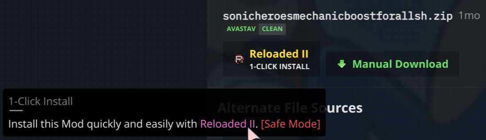

# Send Downloads to Specific Mod Manager

!!! info "Current System Overview"
    
    Nexus Mods provides a 'Mod Manager Download' button that automatically sends downloads to your mod manager using `nxm://` protocol links.

- **Status:** Unknown/Shortlisted 

<figure markdown="span">
  
  <figcaption>'Mod Manager' download button, as seen today.</figcaption>
</figure>

Pressing this button opens a URL that starts with `nxm://`; and it is sent to the last application
on the user's computer that said `'I can handle nxm://'`.

## How It Works Today

When you click the "Mod Manager Download" button, it creates a special URL starting with `nxm://`. Your operating system then sends this link to whichever mod manager was the last one to register as being able to handle these links.

## Current Problems

### Problem 1: Vortex-Only Policy

!!! warning "Download button is ONLY allowed for games supported by Vortex"

    The current site policy is to only allow 'Mod Manager' download
    button to be shown if a game is supported by Vortex Mod Manager.(1)
    { .annotate }

    1. A few (<10) legacy games from before this policy are exceptions.

This is stated to be in order to 'avoid confusion', but it goes against our core ethos of
*making modding easy*.

Without a *'mod manager download'* button, users would have to explicitly read
the *mod description* in order to learn how to install a mod.

In a world where attention spans are short this is difficult. People expect things to *'just work'*.
With people ***new to modding*** this creates a barrier to entry. Especially affected are smaller, less popular
games which have the potential to become big in the future.

<figure markdown="span" class="annotate">
  
  <figcaption>Modding has to be simple enough that a dad can do it.(1)</figcaption>
</figure>

1. [Original Image designed by lunnadesign / Freepik](http://www.freepik.com)

!!! info "In the past this has prevented myself from integrating with the Nexus Mods website."

If someone creates a piece of software that supports modding for a game, they should be able to get
a working *'Mod Manager'* download button for it, with the appropriate branding.

The current limitation sometimes leads to the creation of some 'minimal' plugins for Vortex; 
just to unlock the download button and then redirect users to the actual modding tool.

These plugins are often unmaintained, become broken, and unsupported, *making easy modding hard*.

!!! warning "Vortex is only available on Windows"

    Users on other operating systems (e.g. Linux, macOS) ***cannot even natively run Vortex***;
    effectively locking them out of the *'Mod Manager Download'* button without massive, difficult
    hacks.

!!! info "This also creates issues for our very own `Nexus Mods App`"

### Problem 2: Downloads Go to Wrong Mod Manager

!!! tip "The system sends downloads to whichever mod manager registered for `nxm://` links most recently"

    This isn't always the mod manager you actually want to use for that specific game.

**Example scenario:**

1. You have both Vortex and another mod manager installed
2. You're modding a game that Vortex doesn't support well, but your other manager handles perfectly
3. You click "Mod Manager Download" expecting it to go to the appropriate manager
4. Instead, it goes to Vortex (because you opened it recently), which can't handle the mod properly

**Existing workarounds (and their limitations):**

!!! info "Some 'proxy' tools exist, but have major drawbacks"

    - **[nxmproxy](https://github.com/TanninOne/nxmproxy):** Command-line only, requires technical knowledge
    - **[nxmhandler](https://github.com/ModOrganizer2/modorganizer-nxmhandler):** Built into Mod Organizer 2
    
    **Problems with current solutions:**
    
    - Windows-only
    - Limited game support/hardcoded games (especially `nxmhandler`)
    - Not user-friendly for average modders

## A Real Example: Why This Matters

My past experiences have revolved around modding new games; treading new ground, reverse
engineering games which have not had any sort of modding community or tools available before.

!!! example "An Example: Online Multiplayer Mod with Built-in Mod Support"

    A few years ago, [I built exactly this](https://github.com/Sewer56/Riders.Tweakbox) for Sonic Riders (2006).

    <figure markdown="span" class="annotate">
        
        <figcaption>That one time I added Online Multiplayer to Sonic Riders (2006).<br/>[Random Alpha Gameplay Footage](https://youtu.be/9NIgQZhru_g?t=169)<br/>
        First ever PC code mod: all reverse engineering, netcode, from scratch by yours truly.</figcaption>
    </figure>

Unfortunately, today it's ***impossible*** to create an experience like this with Nexus Mods integration:

1. **Vortex lacks the necessary features:** Mod configuration sync, APIs to pull mod info from mod manager, ask mod manager to restart game with specific set of mods, xplatform support, automatic dependency resolution etc.
2. **No 'Mod Manager Download' button allowed for other software** because the game isn't Vortex-supported

!!! warning "Result: All mods require manual installation"

    This creates a massive barrier to entry, ***especially for less technical friends***.<br/>
    In this case, ***we failed to make free modding easy.***

### The Third-Party Mod Manager Experience Gap

!!! note "I am also a Modding Framework author outside of the Nexus Mods App"

    People use my modding framework with lesser known games, both on Nexus and elsewhere.

    [Modding Framework: Mod Loader with Standardized Mod Format and Supporting Infrastructure]

The contrast is stark: ***on Nexus***, I must ask users to drag-and-drop mod archives into my
software's UI for installation.

!!! info "Which means the users get an inferior experience 😔"

    <figure markdown="span" class="annotate">
        
        <figcaption>A `1 click` install button on a competitor's website.<br/>
        Which I'm not allowed to have on Nexus.<br/>
        Automatically attached to mods uploaded in the correct format.
        </figcaption>
    </figure>

Users sometimes struggle—they skip mod descriptions and tutorials, leading to occasional ***"how do I install mods from Nexus?"*** questions.

A simple 'Mod Manager Download' button would solve this instantly, but ***I'm not allowed to have one.***

I can't bring new users to Nexus in good conscience if I can't provide a ***good experience*** that matches
my expectations.

### Misc Note: Joining Lobbies with Friends

!!! info "A bit off topic, but I thought I'd bring this up."

    As this is a problem that's been on my mind for years and I've never had an opportunity to properly voice it.

!!! danger "Syncing Mods with Friends as a Free User Is Difficult"

Suppose you want to join a *friend's multiplayer lobby* and
are missing some mods; so you need to sync up with them by downloading the same mods 
from Nexus Mods.

```mermaid
flowchart TD
    A[User joins lobby] --> B{Missing mods?}
    B -->|Yes| C[Need to download mod]
    B -->|No| Z[✅ Can play!]
    
    C --> D{Premium user?}
    D -->|Yes| E[✅ Auto-download & install]
    D -->|No| F[Must manually download]
    
    F --> G{Mod Manager Download button available?}
    G -->|No| I[❌ Manual download + manual install]
    
    E --> M{More missing mods?}
    I --> M
    
    M -->|Yes| C
    M -->|No| Z
    
    style Z fill:#00c8531a,stroke:#00c853
    style E fill:#00c8531a,stroke:#00c853
    style I fill:#ff17441a,stroke:#ff1744
```



If the user is a free user, and they are missing 50 cosmetic mods, then for each download they will have to:

- Go to website.
- Click manual download button.
- Wait 5 seconds.
- Wait for download to finish.
- *Manually install the mod.* (⚠️ Error Prone!!)

Repeat for every mod.

## What I Want

I want an improved system that allows the users to download mods to alternative mod managers,
not just Vortex.

Below are some ideas, not the exact implementation details, use those as reference rather than
a strict specification.

### Minimal Criteria

<figure markdown="span" class="annotate">
    
    <figcaption>A very rough sketch as an illustration.</figcaption>
</figure>

A dropdown (or similar) beside the `Mod Manager Download` button that allows users to select
a specific mod manager to send the download to.

Clicking the buttons could/would open aliases of the `nxm://` protocol, such as:

- `mo2-nxm://` sends to Mod Organizer 2
- `vortex-nxm://` sends to Vortex
- `r2-nxm://` sends to Reloaded-II

Mod managers could register themselves under these aliases such that the downloads will always
be sent to the correct mod manager specified by the user.

The button on the right would allow the user to set a 'default' such that the next time they visit
the web page, the default manager is shown without needing to click the dropdown.

### Automatic Association of Modding Framework Mods with Mod Managers

!!! info "Mods using standardized modding frameworks should automatically be marked compatible with supporting Mod Managers."

We can look through the structure of the uploaded files and in many cases determine which mod managers
support downloading a specific mod.

=== "Stardew Valley (SMAPI)"

    ```
    📁 SpaceCore
        📁 docs
            📄 README.md
        📁 i18n
            📄 default.json
        📄 manifest.json
        📄 SpaceCore.dll
    ```

    Every mod contains a `manifest.json` file that describes the mod and its metadata.

=== "Bannerlord"

    ```
    📁 ImprovedGarrisons
        📄 SubModule.xml
        📁 bin
            📁 Win64_Shipping_Client
                📄 ImprovedGarrisons.dll
    ```

    Every mod contains a `SubModule.xml` file that describes the mod and its metadata.

=== "Reloaded-II"

    ```
    📁 reloaded.sharedlib.hooks
        📁 x64
            📄 reloaded.sharedlib.hooks.dll
        📄 Preview.png
        📄 ModConfig.json
    ```

    Every mod contains a `ModConfig.json` file that describes the mod and its metadata.

In these cases if we find an upload with a matching file structure, e.g. `<folder>/manifest.json` (or
simply `manifest.json`) we can deduce that in the case of Stardew Valley, the mod is a `SMAPI` mod.

Behind the scenes, we should tag the mod as `smapi`, and show `Mod Manager Download` buttons
for all mod managers that support mods with the `smapi` tag.

If tagging is done with tags on a per-game basis, then the probability of false positives is low.
If it is done on a global basis, we would need more advanced [metadata parsing](./metadata-parsing.md).

### Avoiding Spamming Mod Manager Options in UI

!!! info "Some games may have multiple mod managers available."

    In which case, you may want to filter which mod managers are shown in the dropdown.

!!! note "Most games usually have 1/2 mod managers, so this is low priority."

When a user logs in with a specific mod manager, the option to download with that mod manager should
appear in the UI. Until then, we can hide (in some way) the other mod managers.

We may choose to have an extra place to see what mod managers can be used, e.g. in an extra dropdown,
or section of the dropdown; but that would be left to design team.