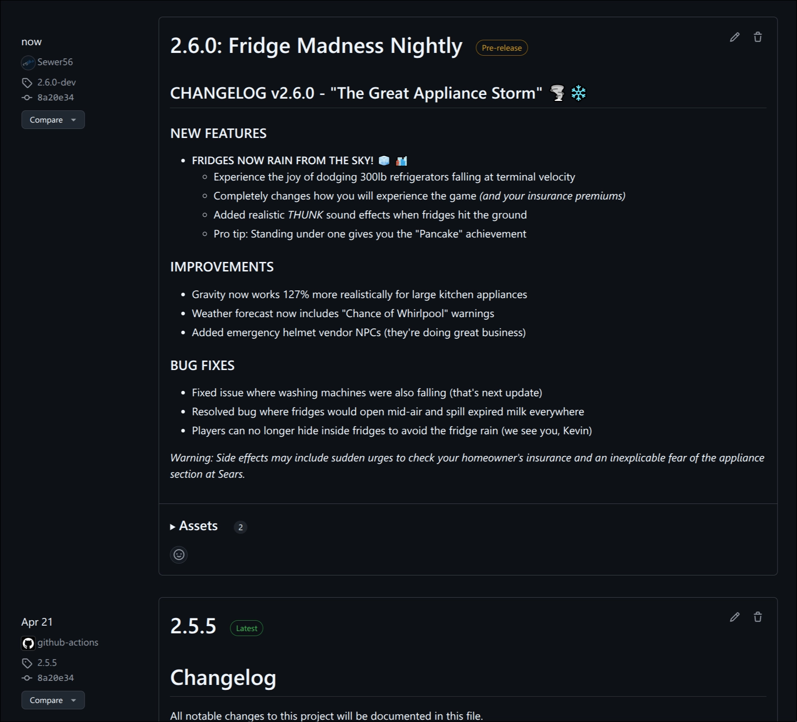

# Different Release Branches (Beta, Nightly, Final)

- **Status:** Unknown/Shortlisted 

!!! info "A system for managing different release channels for mods and tools"

    Modern software development uses multiple release channels (stable, beta, alpha, feature)
    to let users choose between stability and new features. Modding platforms should adopt this approach.

For the few of us that maintain core modding tools(1) this is rather crucial.
{ .annotate }

1. Think 'mod loaders', 'script extenders', 'mod frameworks', 'core mods's etc.<br/><br/>
   Where pushing a bad release can mean breaking the game for hundreds of thousands of users and having to scramble to fix it during the work week.

## Context

!!! info "Semantic Versioning in Modding Frameworks"

    Many modern modding frameworks use [semantic versioning](https://semver.org/) with pre-release
    tags like `-beta`, `-alpha`, and `-rc`.
    
    While this standardizes version representation, these tags confuse non-technical users when mixed
    with stable releases in flat lists.

=== "Stardew Valley (SMAPI)"

    ```
    📁 SpaceCore
        📄 manifest.json  ← Contains mod metadata
        📄 SpaceCore.dll
        📁 docs
            ...
        📁 i18n
            ... 
    ```

    ```json
    {
        "UniqueID": "spacechase0.SpaceCore",
        "Name": "SpaceCore",
        "Author": "spacechase0",
        "Version": "1.28.0-beta"  // ← Pre-release tag
    }
    ```

=== "Bannerlord"

    ```
    📁 ImprovedGarrisons
        📄 SubModule.xml  ← Contains mod metadata
        📁 bin
            📁 Win64_Shipping_Client
                📄 ImprovedGarrisons.dll
    ```

    ```xml
    <Module>
        <Id>ImprovedGarrisons</Id> 
        <Name>Improved Garrisons</Name>
        <Author>Sidiess</Author>
        <Version>1.0.0-beta</Version>  <!-- ← Pre-release tag -->
    </Module>
    ```

=== "Reloaded-II"

    ```
    📁 reloaded.sharedlib.hooks
        📄 ModConfig.json  ← Contains mod metadata
        📄 Preview.png
        📁 x64
            📄 reloaded.sharedlib.hooks.dll
    ```

    ```json
    { 
        "ModId": "reloaded.sharedlib.hooks",
        "ModName": "Reloaded II Shared Lib: Reloaded.Hooks",
        "ModAuthor": "Sewer56",
        "ModVersion": "1.16.3-beta"  // ← Pre-release tag
    }
    ```

## Examples of Flat Release Lists

!!! warning "The Problem: Users can't distinguish between stable and experimental releases"

<figure markdown="span">
  
  <figcaption>GitHub releases: Minor beta versions are acceptable...</figcaption>
</figure>

<figure markdown="span">
  
  <figcaption>...until experimental builds meant for developers appear at the top</figcaption>
</figure>

<figure markdown="span" class="annotate">
  
  <figcaption>Nexus Mods has the same issue - beta versions appear above stable releases(1)</figcaption>
</figure>

1. In default (Name) sorting, older beta versions appear *above* stable releases. Or, in reverse order, depending on Ascending/Descending.

### Common Issues

!!! danger "Feature Branches"

    Users mistake experimental feature branches for stable releases
    
    ```
    📦 Available Downloads:
    ├── v1.8.2-feature.experimental-new-ui   ← User thinks this is newest
    ├── v1.8.2                               ← Actual stable release
    └── v1.8.1
    ```

    The user receives the wrong impression of the mod.

!!! danger "Nightly Builds" 

    Automated development builds bury stable releases in the list
    
    ```
    📦 Available Downloads:
    ├── v1.9.0-nightly.20250605    ← Today's broken build
    ├── v1.9.0-nightly.20250604    ← Yesterday's build  
    ├── v1.9.0-nightly.20250603    ← Day before...
    ├── v1.9.0-nightly.20250602    
    ├── v1.9.0-nightly.20250601    
    ├── ...
    └── v1.8.5                     ← Stable release buried at bottom
    ```

    So the end user is not able to find it.

!!! danger "Version Confusion"

    Users see `1.1.0-beta.1` above `1.0.1` and assume it's "newer/better"
    
    ```
    📦 Available Downloads (sorted by name):
    ├── v1.1.0-beta.1              ← User downloads this thinking it's newer
    ├── v1.1.0-alpha.3             
    ├── v1.0.1                     ← Actual latest stable
    └── v1.0.0
    ```

## What I Want: Release Branch System

### Release Channel Categories

!!! info "Different release channels serve different user needs"

They can generally be categorized into four main channels:

| Channel     | Target Audience  | Update Frequency | Stability | Purpose                       |
| ----------- | ---------------- | ---------------- | --------- | ----------------------------- |
| **Stable**  | General users    | Monthly          | High      | Production-ready releases     |
| **Beta**    | Testers          | Bi-weekly        | Medium    | Feature-complete pre-releases |
| **Nightly** | Contributors     | Nightly          | Low       | Latest development code       |
| **Feature** | Specific testers | As needed        | Variable  | Work-in-progress features     |

And minor variations thereof.

### Mod Manager Integration

!!! tip "Users should be able to select their preferred release channel"

    Instead of manually parsing version strings, mod managers could provide a dropdown to switch between channels.


On the website this may look something more similar to:

<figure markdown="span" class="annotate">
  
  <figcaption>A 'branch' selector tab; which should default to 'Stable'(1)</figcaption>
</figure>

1. Or 'All' if overwritten by user preference in settings.

### Benefits for Different User Types

=== "Casual Users"

    - Always get stable, tested releases
    - No confusion about which version to download
    - Reduced risk of game-breaking bugs

=== "Beta Testers"

    - Easy access to upcoming features
    - Clear indication that they're testing pre-release software
    - Can provide feedback before stable release

=== "Mod Developers"

    - Can test against upcoming changes early
    - Access to feature branches for compatibility testing
        - e.g. Can work against new work-in-progress APIs easier.
    - Clear separation between development and production code

=== "Content Creators"

    - Can choose between stable (for videos) and beta (for preview content)
    - Reduced risk of broken recordings due to unstable mods

## Implementation Approach

!!! note "This is a conceptual example, not a final specification"

    Remember, I wrote all these pages in 1.5 days combined,
    this just visually shows how it hypothetically could work.

### How Branches Work

**Step 1: Create Branches**

Mod authors can create release branches (Stable, Beta, Alpha, etc.) in their mod page settings:

<figure markdown="span" class="annotate">
  
  <figcaption>Creating release branches in mod page settings(1)</figcaption>
</figure>

1. UI mockup - actual design would be determined by the design team

**Step 2: Assign Files to Branches**

When uploading files, authors select which branch the file belongs to:

<figure markdown="span" class="annotate">
  
  <figcaption>Assigning uploaded files to specific branches(1)</figcaption>
</figure>

1. Authors can change branch assignments after upload if they forget to set it initially

**Default Behavior:** Most mods start with no branches (everything appears in the default view), since only complex mods/frameworks typically need this feature.(1)
{ .annotate }

1. A lot of them, very important mods. Your mod frameworks, mod loaders, core mods, etc.

### Automatic Branch Detection

!!! tip "Smart branch assignment based on mod metadata"

    For supported modding frameworks, the system automatically detects and assigns branches based on version strings in mod files.

**Example: SMAPI Mods**

```json
{
    "UniqueID": "spacechase0.SpaceCore",
    "Name": "SpaceCore", 
    "Author": "spacechase0",
    "Version": "1.28.0-beta"  // ← Automatically creates/assigns "Beta" branch
}
```

**Automatic Categorization Rules:**

- `1.0.0` → **Stable** branch
- `1.1.0-beta` → **Beta** branch  
- `1.0.1-dev` → **Nightly** branch

This should leverage existing [metadata parsing](./metadata-parsing.md) capabilities.

!!! tip "Allow opt-out as a mod page setting."

    A small number of mod authors may prefer to manually assign branches, if they don't like to use
    established versioning conventions or have unique workflows.

### API Integration

**For Smaller Communities**

Games without built-in metadata parsing support can use the planned **Mod Upload API** to 
assign branches to files as they're being uploaded.

This ensures all modding communities can benefit, regardless of their game's popularity or staff support level.

!!! info "We might not be able to give all communities our blessing"

    After all, we can't parse every mod metadata format out there; but we can still
    provide the tools to make it possible for them to do it themselves.
