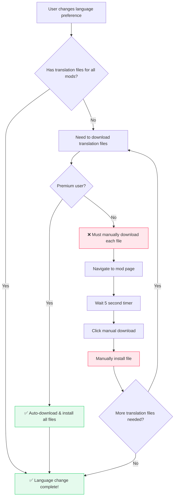

# Batch Tiny File Downloads

- **Status:** Unknown

!!! info "I want *free users* to be able to download a lot of tiny files in batch."

    Without having to visit each mod page one by one.

This is especially relevant for my project of building a [Next Generation Modding Framework](https://reloaded-project.github.io/Reloaded-III/). 2 years in, 3-4 still to go!

*Specifically*, I want to be able to download a large number of files (<4KB in size) for certain
*specific mod types* (such as text-only translations) without requiring free users to visit each
mod page individually.

!!! note "200 files for translations of 200 mods @ 4KB each is only 800KB of data."

    But around *1 hour of work* for a free user to download and install them all manually at an
    ***unrealistic*** sustained 18 seconds per mod download.

## The Translation Problem

!!! info "Modern modding frameworks support comprehensive localisation systems"

In my [Reloaded3 Specification](https://reloaded-project.github.io/Reloaded-III/), translations work through a modular system where:

- **Users can change language for everything at once:** The mod manager, mod loader, mod configs, and all installed mods can switch languages simultaneously.
- **Community-driven translations:** Any user can create and submit translations for any mod using the ["sideloading" system](https://reloaded-project.github.io/Reloaded-III/Common/Localisation/Adding-Localisations.html)
    - This allows translation authors to be rewarded for their work.
    - Avoids having mod authors to maintain/oversee translations themselves.
- **Tiny file sizes:** Translation files are typically small `.toml` files containing just text strings
- **Cascading language support:** Users can set multiple preferred languages that fall back to each other

### Why Hosting Outside Nexus Is Undesirable

!!! warning "*Community translators deserve their Donation Points!!*"

    That's all there is to it!

While I *could* self-host translations (as I'll be indexing them anyway for search), my primary concern
is *to not steal* from the community.

**The core problem** is hosting translations outside of Nexus would:

- **Deprive translators of rightfully earned Donation Points** they deserve for their contribution.
- **Disincentivize future translations** - seeing nearly no mod downloads as a result of mirroring would discourage translators from creating new translations.
- **Drive translators to alternative platforms** - users deprived of Donation Points would be incentivized to host their files elsewhere, reducing traffic.

**It's simply not fair** to deprive community members of the recognition and rewards they've earned for their translation work.
The solution needs to keep translations on Nexus while making them accessible.

## The Current Situation for Free Users

!!! danger "Changing language in a typical setup could require downloading many tiny files"

When a user wants to change their language preference, they potentially need translation files for:

- **The mod manager itself** (1 translation package)
- **The mod loader** (1 translation package)
- **Each installed mod** (potentially 50-200+ mods in a typical setup)

### Current Workflow Pain

The current workflow for a non-premium user looks like this:



**The reality:** If a user has 200 mods and wants to switch from English to French, they would need to:

1. **Navigate to 200+ mod pages**
2. **Click 'Start Download' 200+ times**
3. **Wait through 200+ download timers** (5 seconds each = 16+ minutes of pure waiting)
4. **Manually install each tiny file**

For files that are often **less than 1KB in size** containing simple text strings like:

```toml
[[GAME_TITLE]]
Super Cool Racing Game

[[START_BUTTON]]
Start Game

[[EXIT_BUTTON]]
Exit

[[CONFIG_SELECT_CHARACTER]] # Mod config option: Pick default character
Select Character
```

which add up to less than 1MB of data in total.

!!! warning "Non-Vortex mod managers are not allowed to have 'Mod Manager Download' buttons"

    This is why each translation file would require a manual install.
    (See: [The Vortex Only Policy](./nxm-handler.md#problem-1-vortex-only-policy))

    Per current Nexus policy, only Vortex-supported games are allowed to show the 'Mod Manager Download'
    button. This means alternative mod managers can use manual downloads only; unless the game is
    supported by Vortex.

## Hypothetical User Journey

!!! example "Why this matters for actual users"

Consider a typical modding scenario where users install:

- **50-100 gameplay mods** (new characters, stages, mechanics)
- **20-30 cosmetic mods** (UI themes, sound packs)
- **10-20 utility mods** (debugging tools, quality of life improvements)

Suppose that is the contents of a popular collection.

A French 🇫🇷 user joins the community and wants everything in this collection in their native language:

!!! failure "Current Reality"

- **Translation files exist** for most popular mods (created by dedicated community translators)
- **Each file is 1-3KB** of simple text strings
- **User must manually download 80+ files** with wait timers
- **Process takes 2+ hours** and is extremely tedious
- **Many users give up** and stick with English, missing out on localized content
    - Mod authors never make localized content as a result.

!!! success "With Tiny File Auto-Download"

- **User changes language preference once**
- **Mod manager automatically fetches all available translation files**
- **Process completes in under a minute**
- **Community translators still get their Donation Points**
- **Barrier to entry is eliminated**

## The Technical Reality

!!! info "Translation files are genuinely tiny"

**Expected file size** for typical translation packages:

- **Config translations:** 0.5-2KB (button labels, descriptions)
- **In-game text translations:** 1-4KB (item names, descriptions)
- **Complete mod translations:** Rarely exceed 4KB total

**Bandwidth impact** of auto-downloading these files is negligible, but **user experience impact** is massive.

## What I Want

!!! tip "Simple solution: Allow automatic downloads for batches of files under 4KB from verified translation packages"

**Criteria for auto-download eligibility:**

- **File size < 4KB**
- **Mod page/file marked as 'Translation'**
    - Determined by scanning the upload contents.

This would solve the language barrier problem while:

- ✅ **Keeping translations on Nexus** (translators get Donation Points)
- ✅ **Maintaining the premium value proposition** for large files
    - e.g. Full game translations, texture translations, etc.
- ✅ **Eliminating the tedious download process** for tiny text files
- ✅ **Making modding EASY** to non-English speaker

Something either of sort:

- I'm simply allowed to start a batch download of all translation files
  (with rate limits) without visiting each mod page.

or as a compromise: 

- I'm sent to the website to click this button which will allow me to batch download
  200 files that total up to 500KB in size.

No special 'hey Nexus please zip all these files for me' functionality is requested,
simply a means to fetch tiny files via regular API like a Premium user would.

------------

## Real Life Example: Checking for Updates in Reloaded-II

!!! info "Up until now, I could never add update checking to my modding framework for mods hosted on Nexus."

    Without breaking the Terms of Service anyway, *which would be a bad example for an employee to set.*

In my current [Reloaded-II](https://reloaded-project.github.io/Reloaded-II/) Framework [(wiki)](https://reloaded-project.github.io/Reloaded-II/)
uploaded mod packages look something like this:

```
📄 Reloaded.Hooks.ReloadedII1.16.1_to_1.16.3.7z    (24KB) // 👈 Delta patch/update
📄 Reloaded.Hooks.ReloadedII1.16.3.7z             (724KB) // 👈 Full dependency/mod download
📄 Sewer56.Update.ReleaseMetadata.json.br     (883 Bytes) // 👈 Metadata for Mod Manager 
```

The mod manager needs to download the `ReleaseMetadata.json.br` file, which contains information about
each of the other files on the mod page (their versions, unique mod IDs, etc.) in order to:

- Check if their mod is up to date. 
- Know which file to download if the mod is out of date.
    - And whether the user can use a binary/delta patch. (vcdiff)

A free user is not able check for mod updates as they are not allowed to download the
`ReleaseMetadata.json.br` file without visiting the website.

### Can you not self host the metadata?

!!! info "Under our [Acceptable Use Policy](https://help.nexusmods.com/article/20-acceptable-use-policy), usinga Premium account to scrape update metadata for each mod is not allowed."

    > Fetching data en-masse with the intent to rehost this information on your own service (i.e. scraping).

The other reason is I'm simply working on Reloaded3 and as a single dev I lack the resources 😅; 
as Nexus Mods integration would require:

- `Inter Process Communication (IPC)` to pass info for `nxm://` links to primary process.
- `Login & Session Management` for premium users to access their downloads.
- `Scraping the Website` to fetch mod metadata and update information for free users.
- `A complete UI overhaul` to allow free users to download updates from the Nexus; since previous UIs assume the user can download visiting a website.